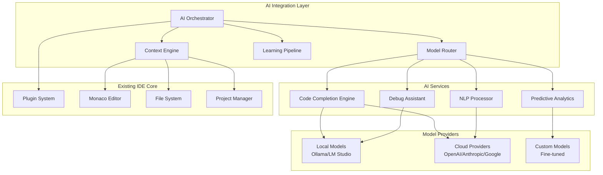
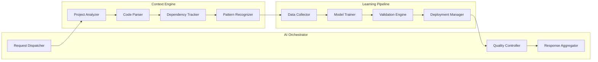

# AI Integration System Design

## Overview

The AI Integration System transforms Sherlock Ω IDE into an AI-first development environment through a sophisticated multi-layered architecture that combines local and cloud-based AI models, real-time learning capabilities, and privacy-preserving processing. The system integrates seamlessly with the existing plugin architecture while providing intelligent assistance across all development workflows.

## Architecture

### High-Level System Architecture



### Core Components Architecture



## Components and Interfaces

### AI Orchestrator

The central coordination component that manages all AI interactions and ensures optimal resource utilization.

```typescript
interface AIOrchestrator {
  // Core orchestration methods
  processRequest(request: AIRequest): Promise<AIResponse>;
  routeToOptimalModel(request: AIRequest): Promise<ModelSelection>;
  aggregateResponses(responses: AIResponse[]): Promise<AIResponse>;
  
  // Quality and performance management
  validateResponse(response: AIResponse): Promise<ValidationResult>;
  trackPerformanceMetrics(metrics: PerformanceMetrics): void;
  optimizeResourceAllocation(): Promise<void>;
  
  // Learning and adaptation
  recordUserFeedback(feedback: UserFeedback): void;
  updateModelPreferences(preferences: ModelPreferences): void;
  triggerModelRetraining(): Promise<void>;
}

interface AIRequest {
  id: string;
  type: AIRequestType;
  context: ProjectContext;
  payload: unknown;
  priority: RequestPriority;
  privacyLevel: PrivacyLevel;
  timestamp: Date;
}

interface AIResponse {
  id: string;
  requestId: string;
  result: unknown;
  confidence: number;
  modelUsed: string;
  processingTime: number;
  tokens: TokenUsage;
}

interface TokenUsage {
  promptTokens: number;
  completionTokens: number;
  totalTokens: number;
}
```

### Code Completion Engine

Provides intelligent code suggestions with deep understanding of project context and user patterns.

```typescript
interface CodeCompletionEngine {
  // Core completion functionality
  getCompletions(context: CompletionContext): Promise<CompletionResult[]>;
  rankSuggestions(suggestions: CompletionResult[]): CompletionResult[];
  applyCompletion(completion: CompletionResult): Promise<void>;
  
  // Learning and adaptation
  recordAcceptance(completion: CompletionResult, accepted: boolean): void;
  updateUserPreferences(preferences: CompletionPreferences): void;
  analyzeCodePatterns(codebase: Codebase): Promise<PatternAnalysis>;
}

interface CompletionContext {
  currentFile: string;
  cursorPosition: Position;
  surroundingCode: string;
  projectContext: ProjectContext;
  userHistory: CompletionHistory;
  languageInfo: LanguageInfo;
}

interface CompletionResult {
  text: string;
  kind: CompletionKind;
  confidence: number;
  documentation?: string;
  insertText: string;
  filterText: string;
  sortText: string;
  additionalTextEdits?: TextEdit[];
}
```

### Natural Language Processor

Handles voice and text commands, converting natural language into actionable IDE operations.

```typescript
interface NLPProcessor {
  // Command processing
  processCommand(input: string, context: IDEContext): Promise<CommandResult>;
  parseIntent(input: string): Promise<IntentAnalysis>;
  executeAction(action: IDEAction): Promise<ActionResult>;
  
  // Voice processing
  processVoiceInput(audio: AudioBuffer): Promise<string>;
  enableVoiceMode(): Promise<void>;
  disableVoiceMode(): void;
  
  // Learning and improvement
  recordCommandSuccess(command: string, success: boolean): void;
  updateLanguageModel(feedback: LanguageFeedback): void;
}

interface IntentAnalysis {
  intent: CommandIntent;
  entities: Entity[];
  confidence: number;
  parameters: Record<string, unknown>;
  suggestedActions: IDEAction[];
}

interface IDEAction {
  type: ActionType;
  target: string;
  parameters: Record<string, unknown>;
  confirmationRequired: boolean;
  undoable: boolean;
}
```

### Predictive Analytics Engine

Analyzes code patterns and predicts potential issues, optimizations, and improvements.

```typescript
interface PredictiveAnalytics {
  // Issue prediction
  predictIssues(codebase: Codebase): Promise<PredictedIssue[]>;
  analyzeCodeQuality(code: string): Promise<QualityAnalysis>;
  suggestOptimizations(code: string): Promise<OptimizationSuggestion[]>;
  
  // Pattern analysis
  identifyPatterns(codebase: Codebase): Promise<CodePattern[]>;
  detectAntiPatterns(code: string): Promise<AntiPattern[]>;
  recommendBestPractices(context: CodeContext): Promise<BestPractice[]>;
  
  // Performance prediction
  predictPerformanceImpact(changes: CodeChange[]): Promise<PerformanceImpact>;
  analyzeDependencyRisks(dependencies: Dependency[]): Promise<RiskAnalysis>;
}

interface PredictedIssue {
  type: IssueType;
  severity: IssueSeverity;
  location: CodeLocation;
  description: string;
  confidence: number;
  suggestedFix?: FixSuggestion;
  learnMore?: string;
}
```

### Debug Assistant

Provides AI-powered debugging assistance with intelligent error analysis and fix suggestions.

```typescript
interface DebugAssistant {
  // Error analysis
  analyzeError(error: RuntimeError): Promise<ErrorAnalysis>;
  suggestFixes(error: RuntimeError): Promise<FixSuggestion[]>;
  explainError(error: RuntimeError): Promise<ErrorExplanation>;
  
  // Debugging assistance
  suggestBreakpoints(code: string): Promise<BreakpointSuggestion[]>;
  analyzeVariableState(variables: Variable[]): Promise<StateAnalysis>;
  traceExecutionPath(stackTrace: StackTrace): Promise<ExecutionAnalysis>;
  
  // Learning from debugging sessions
  recordDebuggingSession(session: DebuggingSession): void;
  learnFromFixApplication(fix: FixSuggestion, success: boolean): void;
}

interface ErrorAnalysis {
  errorType: string;
  rootCause: string;
  affectedComponents: string[];
  severity: ErrorSeverity;
  confidence: number;
  similarIssues: SimilarIssue[];
}
```

## Data Models

### Core AI Data Models

```typescript
// Project context and analysis
interface ProjectContext {
  projectId: string;
  language: string;
  framework?: string;
  dependencies: Dependency[];
  architecture: ArchitecturePattern;
  codeMetrics: CodeMetrics;
  userPreferences: UserPreferences;
}

interface Codebase {
  files: CodeFile[];
  structure: ProjectStructure;
  dependencies: DependencyGraph;
  metrics: CodebaseMetrics;
  patterns: IdentifiedPattern[];
}

enum PrivacyLevel {
  LOCAL_ONLY = 'local_only', // All processing happens on-device
  ANONYMIZED_CLOUD = 'anonymized_cloud', // Code is anonymized before sending to cloud
  FULL_CLOUD = 'full_cloud' // Full context sent to cloud providers
}

enum AITaskType {
  CODE_GENERATION = 'code-generation',
  CODE_COMPLETION = 'code-completion',
  EXPLANATION = 'explanation',
  DEBUGGING = 'debugging',
  REFACTORING = 'refactoring',
  CHAT = 'chat'
}

interface ModelPreferences {
  defaultModel: string; // e.g., 'gpt-4-turbo'
  taskSpecificModels: {
    [task in AITaskType]?: string; // e.g., { 'code-generation': 'deepseek-coder' }
  };
}

interface CompletionSettings {
  autoImport: boolean;
  showDocumentation: boolean;
}

interface PerformanceMetrics {
  requestId: string;
  modelUsed: string;
  responseTimeMs: number;
  tokensPerSecond: number;
  timeToFirstTokenMs?: number;
}

interface UserFeedback {
  interactionId: string;
  rating: 'positive' | 'negative';
  comment?: string;
  correction?: string; // User-provided correction
}

interface CodingStyle {
  indentation: 'tabs' | 'spaces';
  indentSize: number;
  namingConvention: 'camelCase' | 'snake_case' | 'PascalCase';
}

// Learning and adaptation models

// Learning and adaptation models
interface UserPreferences {
  codingStyle: CodingStyle;
  preferredPatterns: string[];
  completionSettings: CompletionSettings;
  privacyLevel: PrivacyLevel;
  modelPreferences: ModelPreferences;
}

interface LearningData {
  userId: string;
  sessionId: string;
  interactions: Interaction[];
  outcomes: Outcome[];
  feedback: UserFeedback[];
  timestamp: Date;
}

// Model management
interface ModelConfiguration {
  modelId: string;
  provider: ModelProvider;
  capabilities: ModelCapability[];
  costPerToken: number;
  maxTokens: number;
  responseTime: number;
  accuracy: number;
}
```

## Error Handling

### Graceful Degradation Strategy

```typescript
interface ErrorHandlingStrategy {
  // Model failure handling
  handleModelFailure(modelId: string, error: ModelError): Promise<FallbackStrategy>;
  switchToFallbackModel(request: AIRequest): Promise<AIResponse>;
  
  // Network and connectivity issues
  handleNetworkFailure(): Promise<OfflineStrategy>;
  enableOfflineMode(): void;
  syncWhenOnline(): Promise<void>;
  
  // Quality control
  handleLowQualityResponse(response: AIResponse): Promise<AIResponse>;
  requestHumanFeedback(issue: QualityIssue): Promise<UserFeedback>;
  
  // Privacy and security
  handlePrivacyViolation(violation: PrivacyViolation): Promise<void>;
  sanitizeData(data: unknown): Promise<unknown>;
}

// Error recovery mechanisms
interface RecoveryMechanism {
  retryWithBackoff(operation: () => Promise<unknown>): Promise<unknown>;
  circuitBreaker(service: string): Promise<boolean>;
  healthCheck(service: string): Promise<HealthStatus>;
  automaticRecovery(error: SystemError): Promise<RecoveryResult>;
}
```

### Error Types and Handling

```typescript
enum AIErrorType {
  MODEL_UNAVAILABLE = 'model_unavailable',
  RATE_LIMIT_EXCEEDED = 'rate_limit_exceeded',
  INVALID_REQUEST = 'invalid_request',
  QUALITY_THRESHOLD_NOT_MET = 'quality_threshold_not_met',
  PRIVACY_VIOLATION = 'privacy_violation',
  NETWORK_ERROR = 'network_error',
  TIMEOUT = 'timeout'
}

interface ErrorHandler {
  canHandle(error: AIError): boolean;
  handle(error: AIError): Promise<ErrorHandlingResult>;
  getRecoveryStrategy(error: AIError): RecoveryStrategy;
}
```

## Testing Strategy

### Comprehensive Testing Approach

```typescript
interface AITestingFramework {
  // Unit testing for AI components
  testModelIntegration(model: AIModel): Promise<TestResult>;
  testCompletionAccuracy(testCases: CompletionTestCase[]): Promise<AccuracyMetrics>;
  testNLPUnderstanding(commands: string[]): Promise<UnderstandingMetrics>;
  
  // Integration testing
  testEndToEndWorkflows(workflows: TestWorkflow[]): Promise<WorkflowResults>;
  testModelSwitching(scenarios: SwitchingScenario[]): Promise<SwitchingResults>;
  testPrivacyCompliance(privacyTests: PrivacyTest[]): Promise<ComplianceResults>;
  
  // Performance testing
  testResponseTimes(loadTests: LoadTest[]): Promise<PerformanceMetrics>;
  testScalability(scalabilityTests: ScalabilityTest[]): Promise<ScalabilityResults>;
  testResourceUsage(usageTests: UsageTest[]): Promise<ResourceMetrics>;
  
  // Quality assurance
  testOutputQuality(qualityTests: QualityTest[]): Promise<QualityMetrics>;
  testLearningEffectiveness(learningTests: LearningTest[]): Promise<LearningMetrics>;
  testUserSatisfaction(satisfactionTests: SatisfactionTest[]): Promise<SatisfactionMetrics>;
}
```

### Test Data and Validation

```typescript
interface TestDataManager {
  // Test data generation
  generateSyntheticCodebase(specifications: CodebaseSpec): Promise<Codebase>;
  createTestScenarios(requirements: TestRequirements): Promise<TestScenario[]>;
  generateUserInteractionData(patterns: InteractionPattern[]): Promise<InteractionData>;
  
  // Validation and benchmarking
  validateModelAccuracy(model: AIModel, testSet: TestSet): Promise<AccuracyReport>;
  benchmarkPerformance(models: AIModel[], benchmarks: Benchmark[]): Promise<BenchmarkReport>;
  compareModelOutputs(models: AIModel[], inputs: TestInput[]): Promise<ComparisonReport>;
}
```

## Performance Optimization

### Response Time Optimization

```typescript
interface PerformanceOptimizer {
  // Caching strategies
  implementResponseCaching(cacheConfig: CacheConfiguration): void;
  optimizeModelLoading(loadingStrategy: LoadingStrategy): Promise<void>;
  preloadFrequentModels(usage: UsagePatterns): Promise<void>;
  
  // Request optimization
  batchRequests(requests: AIRequest[]): Promise<AIRequest[]>;
  prioritizeRequests(requests: AIRequest[]): AIRequest[];
  optimizeTokenUsage(request: AIRequest): AIRequest;
  
  // Resource management
  manageMemoryUsage(memoryConfig: MemoryConfiguration): void;
  optimizeCPUUsage(cpuConfig: CPUConfiguration): void;
  balanceLoadAcrossModels(loadConfig: LoadBalancingConfiguration): void;
}
```

### Scalability Architecture

```typescript
interface ScalabilityManager {
  // Horizontal scaling
  scaleModelInstances(demand: DemandMetrics): Promise<ScalingResult>;
  distributeLoad(requests: AIRequest[]): Promise<DistributionResult>;
  manageModelReplicas(replicationConfig: ReplicationConfiguration): Promise<void>;
  
  // Vertical scaling
  optimizeModelParameters(optimizationConfig: OptimizationConfiguration): Promise<void>;
  adjustResourceAllocation(allocationConfig: AllocationConfiguration): Promise<void>;
  tunePerformanceSettings(tuningConfig: TuningConfiguration): Promise<void>;
}
```

## Security and Privacy

### Privacy-Preserving Processing

```typescript
interface PrivacyManager {
  // Data protection
  anonymizeCode(code: string): Promise<string>;
  detectSensitiveInformation(data: unknown): Promise<SensitivityAnalysis>;
  applyDataMinimization(request: AIRequest): Promise<AIRequest>;
  
  // Local processing
  enableLocalOnlyMode(): Promise<void>;
  validateLocalModelCapabilities(): Promise<CapabilityReport>;
  syncLocalModels(): Promise<SyncResult>;
  
  // Compliance
  enforceGDPRCompliance(request: AIRequest): Promise<ComplianceResult>;
  auditDataUsage(auditConfig: AuditConfiguration): Promise<AuditReport>;
  manageConsentPreferences(preferences: ConsentPreferences): Promise<void>;
}
```

### Security Architecture

```typescript
interface SecurityManager {
  // Model security
  validateModelIntegrity(model: AIModel): Promise<IntegrityResult>;
  scanForMaliciousContent(content: unknown): Promise<SecurityScanResult>;
  enforceAccessControls(request: AIRequest): Promise<AccessResult>;
  
  // Communication security
  encryptModelCommunication(communication: ModelCommunication): Promise<EncryptedCommunication>;
  validateAPICredentials(credentials: APICredentials): Promise<ValidationResult>;
  monitorSecurityThreats(monitoring: SecurityMonitoring): Promise<ThreatReport>;
}
```

This comprehensive design provides the foundation for implementing the AI Integration System that will power Cycle 4 evolution of Sherlock Ω IDE. The architecture ensures scalability, privacy, performance, and seamless integration with existing IDE components while providing advanced AI capabilities across all development workflows.