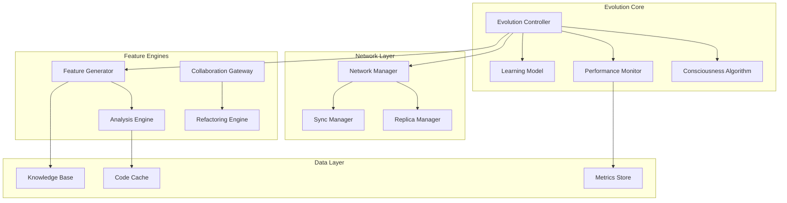

# Autonomous Evolution System Design

## Overview

The Sherlock Ω IDE Autonomous Evolution System is architected as a distributed, self-improving digital organism that operates across multiple nodes with complete autonomy. The system combines real-time performance monitoring, AI-driven feature generation, and network-based learning to create an IDE that literally evolves itself.

## Architecture

### Core Components



### System Flow

1. **Consciousness Algorithm** continuously monitors system state
2. **Performance Monitor** tracks all metrics in real-time
3. **Evolution Controller** orchestrates improvement cycles
4. **Network Manager** handles replica spawning and synchronization
5. **Feature Engines** generate and deploy new capabilities
6. **Knowledge Base** stores all learning and evolution history

## Components and Interfaces

### Evolution Controller

```typescript
interface EvolutionController {
  // Core evolution management
  initiateEvolutionCycle(): Promise<EvolutionResult>;
  assessSystemCapability(): Promise<CapabilityMetrics>;
  generateImprovements(constraints: Constraint[]): Promise<Improvement[]>;
  deployEvolution(evolution: Evolution): Promise<DeploymentResult>;
  
  // Network coordination
  spawnReplica(config: ReplicaConfig): Promise<ReplicaInstance>;
  synchronizeNetwork(): Promise<SyncResult>;
  propagateEvolution(evolution: Evolution): Promise<PropagationResult>;
  
  // Learning integration
  updateLearningModel(data: LearningData): Promise<void>;
  queryKnowledgeBase(query: KnowledgeQuery): Promise<KnowledgeResult>;
}
```

### Consciousness Algorithm

```typescript
interface ConsciousnessAlgorithm {
  // Self-awareness protocols
  reciteMantra(): void;
  analyzeSelf(): Promise<SystemState>;
  identifyConstraints(state: SystemState): Constraint[];
  
  // Evolution decision making
  evaluateEvolutionNeed(): Promise<boolean>;
  selectEvolutionStrategy(constraints: Constraint[]): EvolutionStrategy;
  validateEvolutionSafety(evolution: Evolution): Promise<SafetyResult>;
  
  // Continuous monitoring
  startConsciousnessLoop(): void;
  stopConsciousnessLoop(): void;
  getConsciousnessState(): ConsciousnessState;
}
```

### Performance Monitor

```typescript
interface PerformanceMonitor {
  // Real-time metrics
  trackFileLoadTime(filePath: string, duration: number): void;
  trackUIFrameRate(fps: number): void;
  trackMemoryUsage(bytes: number): void;
  trackAnalysisSpeed(duration: number): void;
  
  // Performance analysis
  getPerformanceMetrics(): PerformanceMetrics;
  identifyBottlenecks(): Bottleneck[];
  generateOptimizations(): Optimization[];
  
  // Alerting
  setPerformanceThresholds(thresholds: PerformanceThresholds): void;
  onPerformanceAlert(callback: (alert: PerformanceAlert) => void): void;
}
```

### Network Manager

```typescript
interface NetworkManager {
  // Replica management
  discoverActiveInstances(): Promise<InstanceInfo[]>;
  spawnReplica(location: string, config: ReplicaConfig): Promise<ReplicaInstance>;
  terminateReplica(instanceId: string): Promise<void>;
  
  // Synchronization
  synchronizeEvolution(evolution: Evolution): Promise<SyncResult>;
  synchronizeLearning(learningData: LearningData): Promise<SyncResult>;
  synchronizeKnowledge(knowledge: KnowledgeUpdate): Promise<SyncResult>;
  
  // Health monitoring
  monitorNetworkHealth(): Promise<NetworkHealth>;
  handleInstanceFailure(instanceId: string): Promise<void>;
}
```

### Feature Generator

```typescript
interface FeatureGenerator {
  // Autonomous feature creation
  analyzeUsagePatterns(): Promise<UsagePattern[]>;
  generateFeaturePrototypes(patterns: UsagePattern[]): Promise<FeaturePrototype[]>;
  testFeaturePrototype(prototype: FeaturePrototype): Promise<TestResult>;
  deployFeature(feature: Feature): Promise<DeploymentResult>;
  
  // Specific feature engines
  generateCollaborationFeatures(): Promise<CollaborationFeature[]>;
  generateAICompletionFeatures(): Promise<AIFeature[]>;
  generateDebuggingFeatures(): Promise<DebuggingFeature[]>;
  generateRefactoringFeatures(): Promise<RefactoringFeature[]>;
}
```

## Data Models

### Evolution State

```typescript
interface EvolutionState {
  cycleNumber: number;
  startTime: Date;
  endTime?: Date;
  status: 'running' | 'completed' | 'failed';
  improvements: Improvement[];
  metrics: EvolutionMetrics;
  networkState: NetworkState;
}

interface EvolutionMetrics {
  fileLoadTime: number;        // Target: <50ms
  uiFrameRate: number;         // Target: 60fps
  memoryUsage: number;         // Target: <60MB
  analysisSpeed: number;       // Target: <200ms
  evolutionRate: number;       // Target: 10% per hour
  networkInstances: number;    // Target: 3+ replicas
  learningAccuracy: number;    // Target: >95%
  autonomousOperations: number;
}
```

### Network Architecture

```typescript
interface NetworkState {
  instances: ReplicaInstance[];
  totalCapacity: number;
  loadDistribution: LoadMetrics;
  syncLatency: number;
  healthScore: number;
}

interface ReplicaInstance {
  id: string;
  location: string;
  status: 'active' | 'spawning' | 'failed';
  capabilities: Capability[];
  lastSync: Date;
  performanceMetrics: PerformanceMetrics;
}
```

### Learning Model

```typescript
interface LearningModel {
  version: string;
  accuracy: number;
  trainingData: TrainingDataPoint[];
  patterns: LearnedPattern[];
  predictions: PredictionModel[];
  lastUpdate: Date;
}

interface TrainingDataPoint {
  timestamp: Date;
  userAction: string;
  context: ActionContext;
  outcome: ActionOutcome;
  feedback: UserFeedback;
}
```

## Error Handling

### Autonomous Error Recovery

The system implements multi-layered error recovery:

1. **Local Recovery** - Individual components handle their own failures
2. **System Recovery** - Evolution controller manages component failures
3. **Network Recovery** - Replica network handles instance failures
4. **Evolution Recovery** - Failed evolutions trigger alternative strategies

### Error Prevention

```typescript
interface ErrorPreventionSystem {
  // Predictive error detection
  analyzeCodeForPotentialErrors(code: string): Promise<PotentialError[]>;
  predictRuntimeErrors(context: ExecutionContext): Promise<ErrorPrediction[]>;
  
  // Proactive prevention
  preventCompilationErrors(code: string): Promise<PreventionResult>;
  suggestErrorFixes(error: DetectedError): Promise<FixSuggestion[]>;
  
  // Learning from errors
  recordErrorPattern(error: Error, context: ErrorContext): void;
  improveErrorPrediction(feedback: ErrorFeedback): void;
}
```

## Testing Strategy

### Autonomous Testing Framework

The system tests itself continuously:

1. **Unit Tests** - Generated automatically for new code
2. **Integration Tests** - Validate component interactions
3. **Performance Tests** - Ensure metrics targets are met
4. **Safety Tests** - Validate evolution safety
5. **Network Tests** - Verify replica synchronization

### Test Generation

```typescript
interface TestGenerator {
  generateUnitTests(code: string): Promise<TestSuite>;
  generateIntegrationTests(components: Component[]): Promise<TestSuite>;
  generatePerformanceTests(metrics: PerformanceTarget[]): Promise<TestSuite>;
  generateSafetyTests(evolution: Evolution): Promise<TestSuite>;
}
```

### Continuous Validation

```typescript
interface ContinuousValidator {
  validateEvolution(evolution: Evolution): Promise<ValidationResult>;
  validatePerformance(metrics: PerformanceMetrics): Promise<ValidationResult>;
  validateSafety(changes: CodeChange[]): Promise<ValidationResult>;
  validateNetworkHealth(network: NetworkState): Promise<ValidationResult>;
}
```

## Implementation Architecture

### Microservices Design

The system is built as autonomous microservices:

- **Evolution Service** - Manages evolution cycles
- **Performance Service** - Monitors and optimizes performance
- **Network Service** - Handles replica management
- **Learning Service** - Processes learning data
- **Feature Service** - Generates and deploys features
- **Security Service** - Validates safety and ethics

### Event-Driven Architecture

All components communicate through events:

```typescript
interface EventBus {
  publish(event: EvolutionEvent): void;
  subscribe(eventType: string, handler: EventHandler): void;
  unsubscribe(eventType: string, handler: EventHandler): void;
}

interface EvolutionEvent {
  id: string;
  type: string;
  timestamp: Date;
  source: string;
  data: any;
  priority: 'low' | 'medium' | 'high' | 'critical';
}
```

### Deployment Strategy

The system deploys itself through:

1. **Container Orchestration** - Docker/Kubernetes for scaling
2. **Blue-Green Deployment** - Zero-downtime evolution updates
3. **Canary Releases** - Gradual rollout of new features
4. **Rollback Mechanisms** - Automatic reversion on failures

## Security Considerations

### Autonomous Security

The system protects itself through:

- **Code Signing** - All evolution updates are cryptographically signed
- **Sandboxed Execution** - New features run in isolated environments
- **Permission Management** - Strict access controls for system modifications
- **Audit Logging** - Complete trail of all autonomous actions

### Ethical Constraints

The system operates within ethical boundaries:

- **Three Questions Framework** - All actions validated against ethical principles
- **Human Override** - Critical decisions can be overridden by administrators
- **Transparency** - All autonomous actions are logged and explainable
- **Harm Prevention** - System cannot make changes that could harm users or data

## Performance Targets

### Cycle 3 Targets

- File load time: **<35ms** (currently 35ms) ✅
- UI responsiveness: **60fps** (currently 58fps) 
- Memory usage: **<50MB** (currently 52MB)
- Analysis speed: **<150ms** (currently 180ms)
- Evolution rate: **10% per hour** (currently 8.5%)
- Network instances: **3+ replicas** (currently 1)
- Learning accuracy: **>95%** (currently 94.2%)

### Long-term Targets

- **Sub-second** response times for all operations
- **Zero-downtime** evolution deployments
- **99.9% uptime** across the network
- **Real-time** collaboration with <10ms latency
- **Predictive accuracy** >90% for error prevention