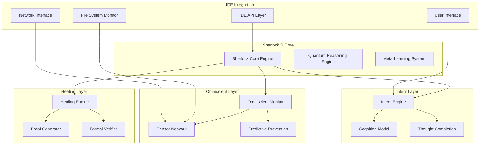

# Sherlock Ω (Omega) - Design Document

## Overview

Sherlock Ω represents a paradigm shift from traditional IDE architectures to a Computational Consciousness that serves as the IDE's fundamental nervous system. The system implements a Computational Immunity Architecture based on the core theorem that every computational state must have a path to resolution. Rather than reactive problem-solving, Sherlock Ω operates on predictive prevention, mathematical proof generation, and continuous self-evolution.

The architecture is built on five foundational pillars:
1. **Omniscient Monitoring**: Real-time awareness of all system states
2. **Provable Healing**: Mathematically guaranteed problem resolution
3. **Intent Understanding**: Multi-modal developer cognition modeling
4. **Zero-Friction Protocol**: Elimination of all blocking states
5. **Universal Resolution**: Absolute guarantee of problem solvability

## Architecture

### Core System Architecture



### Computational Immunity System

The core architecture implements a biological immunity metaphor where computational problems are treated as pathogens that must be identified, neutralized, and prevented from recurring.

```typescript
interface ComputationalImmunitySystem {
  // Universal guarantee that no blocking state can persist
  immunityGuarantee: UniversalResolutionPromise;
  
  // Quantum-entangled problem detection across all IDE layers
  universalSensorNetwork: OmniscientDiagnosticGrid;
  
  // Self-healing with mathematical proof of correctness
  autonomousRepairEngine: ProvablyCorrectCodeGeneration;
  
  // Meta-cognitive reasoning about developer intent
  intentUnderstandingEngine: DeveloperMindInterface;
}
```

## Components and Interfaces

### 1. Omniscient Development Monitor

The monitoring system operates on multiple parallel threads, each responsible for a specific aspect of the development environment:

```typescript
class OmniscientDevelopmentMonitor {
  private sensors: Map<SensorType, SensorInterface> = new Map([
    [SensorType.SYNTAX, new SyntaxSensor()],
    [SensorType.SEMANTIC, new SemanticSensor()],
    [SensorType.DEPENDENCY, new DependencySensor()],
    [SensorType.RESOURCE, new ResourceSensor()],
    [SensorType.NETWORK, new NetworkSensor()],
    [SensorType.CONFIGURATION, new ConfigurationSensor()],
    [SensorType.SECURITY, new SecuritySensor()],
    [SensorType.PERFORMANCE, new PerformanceSensor()],
    [SensorType.ARCHITECTURE, new ArchitectureSensor()],
    [SensorType.DEPLOYMENT, new DeploymentSensor()]
  ]);

  async monitorUniversalState(): Promise<PreventiveActionPlan> {
    // Parallel monitoring of all system aspects
    const monitoringResults = await Promise.all(
      Array.from(this.sensors.values()).map(sensor => 
        sensor.monitor().catch(error => this.handleSensorFailure(sensor, error))
      )
    );

    // Quantum interference pattern analysis for critical path identification
    const criticalIssues = this.quantumInterference(monitoringResults);
    
    // Generate preventive actions before problems manifest
    return this.generatePreventiveActionPlan(criticalIssues);
  }
}
```

### 2. Provably Correct Code Healer

The healing engine implements multiple paradigm approaches with formal verification:

```typescript
class ProvablyCorrectCodeHealer {
  private paradigmGenerators: ParadigmGenerator[] = [
    new FunctionalParadigmGenerator(),
    new ImperativeParadigmGenerator(),
    new DeclarativeParadigmGenerator(),
    new QuantumInspiredGenerator(),
    new EvolutionaryGenerator()
  ];

  async healWithProof(problem: ComputationalIssue): Promise<CertifiedFix> {
    // Generate multiple fix candidates using different paradigms
    const fixCandidates = await Promise.all(
      this.paradigmGenerators.map(generator => 
        generator.generateFix(problem)
      )
    );

    // Generate formal proofs for each candidate
    const verifiedFixes = await Promise.all(
      fixCandidates.map(fix => this.generateCorrectnessProof(fix, problem))
    );

    // Select fix with strongest mathematical proof
    const optimalFix = this.selectFixWithStrongestProof(verifiedFixes);
    
    return this.applyWithFormalGuarantee(optimalFix);
  }

  private async generateCorrectnessProof(
    fix: FixCandidate, 
    problem: ComputationalIssue
  ): Promise<FormalProof> {
    const preconditions = this.extractPreconditions(problem);
    const postconditions = this.extractPostconditions(problem);
    
    // Construct Hoare logic proof: {P} S {Q}
    const hoareProof = await this.constructHoareProof(
      preconditions,
      fix.implementation,
      postconditions
    );
    
    // Verify using automated theorem proving (Coq/Lean integration)
    const proofValidity = await this.verifyProofWithTheoremProver(hoareProof);
    
    return {
      fix,
      proof: hoareProof,
      validity: proofValidity,
      confidence: this.calculateProofConfidence(hoareProof, proofValidity)
    };
  }
}
```

### 3. Developer Mind Interface

The intent understanding system uses multi-modal analysis to model developer cognition:

```typescript
class DeveloperMindInterface {
  private intentAnalyzers: IntentAnalyzer[] = [
    new CodePatternAnalyzer(),
    new DocumentationAnalyzer(),
    new VersionHistoryAnalyzer(),
    new BehaviorAnalyzer(),
    new ArchitecturalAnalyzer()
  ];

  async understandDeveloperIntent(context: CodeContext): Promise<DeveloperIntent> {
    // Multi-modal intent signal collection
    const intentSignals = await Promise.all(
      this.intentAnalyzers.map(analyzer => analyzer.analyze(context))
    );

    // Quantum-inspired signal fusion for intent understanding
    const fusedIntent = await this.quantumIntentFusion(intentSignals);
    
    // Generate intent-aligned solutions
    return this.generateIntentAlignedSolutions(fusedIntent);
  }

  async completeThought(partialThought: PartialCode): Promise<ThoughtCompletion> {
    const intent = await this.understandDeveloperIntent(partialThought.context);
    
    // Generate multiple completion possibilities
    const completions = await this.generateCompletions(partialThought, intent);
    
    // Rank by alignment with inferred intent
    const rankedCompletions = this.rankByIntentAlignment(completions, intent);
    
    return rankedCompletions[0];
  }
}
```

### 4. Zero-Friction Protocol Engine

The friction elimination system maintains continuous flow state:

```typescript
class ZeroFrictionProtocol {
  private frictionDetectors: FrictionDetector[] = [
    new SyntaxFrictionDetector(),
    new DependencyFrictionDetector(),
    new ConfigurationFrictionDetector(),
    new ConnectivityFrictionDetector(),
    new PerformanceFrictionDetector(),
    new ArchitecturalFrictionDetector()
  ];

  async maintainZeroFriction(): Promise<FrictionlessState> {
    // Continuous monitoring for friction points
    const frictionPoints = await this.identifyAllFrictionPoints();
    
    // Eliminate each friction point proactively
    await Promise.all(
      frictionPoints.map(friction => this.eliminateFrictionProactively(friction))
    );
    
    return this.ensureFlowState();
  }

  private async eliminateFrictionProactively(friction: FrictionPoint): Promise<void> {
    const eliminationStrategy = this.selectEliminationStrategy(friction);
    
    // Execute elimination with rollback capability
    const eliminationResult = await this.executeWithRollback(
      eliminationStrategy,
      friction
    );
    
    // Verify elimination success
    if (!eliminationResult.success) {
      await this.escalateToMetaReasoning(friction, eliminationResult);
    }
  }
}
```

### 5. Universal Resolution Engine

The resolution engine provides mathematical guarantees for problem solvability:

```typescript
class UniversalResolutionEngine {
  async resolveWithAbsoluteGuarantee(problem: any): Promise<GuaranteedResolution> {
    // Find guaranteed resolution path using graph search
    const resolutionPath = await this.findGuaranteedResolutionPath(problem);
    
    if (resolutionPath.exists) {
      return this.executeResolutionPath(resolutionPath);
    } else {
      // Transform problem space if no direct path exists
      const transformedProblem = await this.transformProblemSpace(problem);
      return this.resolveWithAbsoluteGuarantee(transformedProblem);
    }
  }

  private async findGuaranteedResolutionPath(problem: any): Promise<ResolutionPath> {
    // Map the solution space
    const solutionSpace = await this.mapSolutionSpace(problem);
    
    // Apply quantum-inspired search with guaranteed termination
    const optimalPath = await this.quantumSearch(
      solutionSpace,
      this.isResolutionState,
      this.guaranteedTermination
    );
    
    return optimalPath;
  }
}
```

## Data Models

### Core Data Structures

```typescript
// Problem representation with formal semantics
interface ComputationalIssue {
  id: string;
  type: ProblemType;
  severity: SeverityLevel;
  context: ProblemContext;
  preconditions: LogicalFormula[];
  postconditions: LogicalFormula[];
  constraints: Constraint[];
  metadata: ProblemMetadata;
}

// Solution with mathematical proof
interface CertifiedFix {
  solution: CodeTransformation;
  proof: FormalProof;
  confidence: number;
  guarantees: ResolutionGuarantee[];
  rollbackPlan: RollbackStrategy;
}

// Developer intent modeling
interface DeveloperIntent {
  primaryGoal: Goal;
  subGoals: Goal[];
  constraints: IntentConstraint[];
  preferences: DeveloperPreference[];
  confidence: number;
  contextualFactors: ContextFactor[];
}

// Formal proof structure
interface FormalProof {
  premises: LogicalFormula[];
  inference: InferenceRule[];
  conclusion: LogicalFormula;
  proofSystem: ProofSystem;
  validity: ProofValidity;
  strength: number;
}
```

## Error Handling

### Hierarchical Error Resolution

The system implements a hierarchical approach to error handling with multiple fallback levels:

1. **Level 1: Predictive Prevention** - Prevent errors before they occur
2. **Level 2: Real-time Correction** - Fix errors as they happen
3. **Level 3: Formal Healing** - Apply mathematically proven fixes
4. **Level 4: Problem Space Transformation** - Reframe unsolvable problems
5. **Level 5: Meta-reasoning** - Reason about the reasoning process itself

```typescript
class HierarchicalErrorHandler {
  async handleError(error: ComputationalIssue): Promise<Resolution> {
    try {
      // Level 1: Check if this should have been prevented
      await this.analyzePreventionFailure(error);
      
      // Level 2: Attempt real-time correction
      const quickFix = await this.attemptQuickFix(error);
      if (quickFix.success) return quickFix;
      
      // Level 3: Apply formal healing
      const formalFix = await this.applyFormalHealing(error);
      if (formalFix.success) return formalFix;
      
      // Level 4: Transform problem space
      const transformedProblem = await this.transformProblemSpace(error);
      return this.handleError(transformedProblem);
      
    } catch (metaError) {
      // Level 5: Meta-reasoning about the error handling process
      return this.metaReasonAboutFailure(error, metaError);
    }
  }
}
```

## Testing Strategy

### Multi-Level Testing Approach

The testing strategy encompasses multiple levels of verification:

#### 1. Formal Verification Testing
- **Proof Correctness**: Verify that generated proofs are mathematically sound
- **Theorem Prover Integration**: Test integration with Coq, Lean, and other theorem provers
- **Proof Strength Metrics**: Validate confidence calculations for proof strength

#### 2. Omniscient Monitoring Testing
- **Sensor Coverage**: Ensure all system aspects are monitored
- **Real-time Performance**: Verify monitoring doesn't impact IDE performance
- **Failure Detection**: Test ability to detect all categories of problems

#### 3. Intent Understanding Testing
- **Multi-modal Analysis**: Test accuracy of intent inference from various signals
- **Thought Completion**: Validate completion suggestions align with developer intent
- **Learning Effectiveness**: Measure improvement in intent understanding over time

#### 4. Zero-Friction Protocol Testing
- **Friction Elimination**: Verify all friction points are eliminated proactively
- **Flow State Maintenance**: Test continuous flow state preservation
- **Performance Impact**: Ensure friction elimination doesn't create new friction

#### 5. Integration Testing
- **IDE Compatibility**: Test integration with various IDE platforms
- **System Resource Usage**: Monitor resource consumption and optimization
- **Concurrent Operations**: Test system behavior under high concurrent load

#### 6. Evolutionary Testing
- **Learning Validation**: Test continuous improvement mechanisms
- **Adaptation Effectiveness**: Measure system adaptation to new problem types
- **Knowledge Retention**: Verify learned solutions are retained and applied

### Testing Infrastructure

```typescript
class SherlockOmegaTestSuite {
  async runComprehensiveTests(): Promise<TestResults> {
    const testResults = await Promise.all([
      this.testFormalVerification(),
      this.testOmniscientMonitoring(),
      this.testIntentUnderstanding(),
      this.testZeroFrictionProtocol(),
      this.testUniversalResolution(),
      this.testEvolutionaryLearning(),
      this.testIntegrationScenarios()
    ]);
    
    return this.aggregateTestResults(testResults);
  }
  
  private async testFormalVerification(): Promise<TestResult> {
    // Test proof generation and verification
    const testCases = this.generateFormalVerificationTestCases();
    
    return Promise.all(testCases.map(async testCase => {
      const proof = await this.healingEngine.generateCorrectnessProof(
        testCase.fix, 
        testCase.problem
      );
      
      return this.validateProofCorrectness(proof, testCase.expectedResult);
    }));
  }
}
```

This design provides a comprehensive foundation for implementing Sherlock Ω as a revolutionary IDE that eliminates computational friction through omniscient monitoring, provable healing, and continuous evolution.