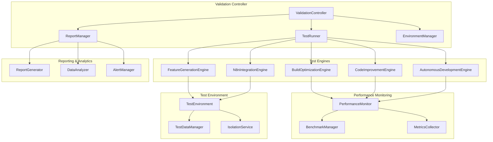

# System Validation Design

## Overview

The Sherlock Ω IDE System Validation framework provides comprehensive testing and validation of all core capabilities through automated road testing scenarios. The system is designed as a modular validation engine that can execute performance benchmarks, feature tests, integration validations, and autonomous operation monitoring in controlled environments.

## Architecture

### Core Components



### System Flow

1. **ValidationController** orchestrates all validation scenarios
2. **TestRunner** executes specific test engines in sequence
3. **EnvironmentManager** provides isolated test environments
4. **Test Engines** perform specific validation scenarios
5. **PerformanceMonitor** tracks metrics and benchmarks
6. **ReportManager** generates comprehensive validation reports

## Components and Interfaces

### ValidationController

```typescript
interface ValidationController {
  // Core validation orchestration
  executeFullValidation(): Promise<ValidationResult>;
  executeBuildOptimizationTest(): Promise<BuildOptimizationResult>;
  executeCodeImprovementTest(): Promise<CodeImprovementResult>;
  executeFeatureGenerationTest(): Promise<FeatureGenerationResult>;
  executeN8nIntegrationTest(): Promise<N8nIntegrationResult>;
  executeAutonomousDevelopmentTest(): Promise<AutonomousDevelopmentResult>;
  
  // Performance validation
  executePerformanceBenchmarks(): Promise<PerformanceBenchmarkResult>;
  validatePerformanceTargets(): Promise<PerformanceValidationResult>;
  
  // Environment management
  createTestEnvironment(config: TestEnvironmentConfig): Promise<TestEnvironment>;
  cleanupTestEnvironment(environment: TestEnvironment): Promise<void>;
  
  // Reporting and monitoring
  generateValidationReport(results: ValidationResult[]): Promise<ValidationReport>;
  monitorValidationHealth(): Promise<ValidationHealthStatus>;
}
```

### BuildOptimizationEngine

```typescript
interface BuildOptimizationEngine {
  // Test file creation and processing
  createQuantumStubFile(): Promise<string>;
  processTestFile(filePath: string): Promise<BuildOptimizationResult>;
  measureBuildPerformance(beforeTime: number, afterTime: number): PerformanceMetrics;
  
  // Quantum advantage validation
  validateQuantumAdvantage(result: BuildOptimizationResult): Promise<boolean>;
  calculateSpeedImprovement(before: number, after: number): number;
  integrateQiskitJS(): Promise<QuantumIntegrationResult>;
  
  // Performance measurement
  measureFileLoadTime(): Promise<number>;
  measureBuildTime(operation: () => Promise<void>): Promise<number>;
  validatePerformanceTargets(metrics: PerformanceMetrics): ValidationResult;
}
```

### CodeImprovementEngine

```typescript
interface CodeImprovementEngine {
  // Code analysis and improvement
  createTestCodeWithInefficiencies(): Promise<string>;
  analyzeCodeForImprovements(code: string): Promise<CodeImprovement[]>;
  applyImprovements(code: string, improvements: CodeImprovement[]): Promise<string>;
  calculateQualityScore(code: string): Promise<number>;
  
  // Improvement validation
  validateImprovementCount(improvements: CodeImprovement[]): boolean;
  validateQualityScore(score: number): boolean;
  generateImprovementReport(improvements: CodeImprovement[]): ImprovementReport;
  
  // Learning and feedback
  trackImprovementEffectiveness(before: string, after: string): Promise<EffectivenessMetrics>;
  learnFromImprovementOutcomes(outcomes: ImprovementOutcome[]): Promise<void>;
}
```

### FeatureGenerationEngine

```typescript
interface FeatureGenerationEngine {
  // Feature generation testing
  requestFeatureGeneration(description: string): Promise<FeatureGenerationResult>;
  validateGeneratedFiles(files: GeneratedFile[]): Promise<FileValidationResult>;
  testGeneratedFeature(feature: GeneratedFeature): Promise<FeatureTestResult>;
  integrateFeatureIntoIDE(feature: GeneratedFeature): Promise<IntegrationResult>;
  
  // File management
  validateFileStructure(files: GeneratedFile[]): boolean;
  validateFileContent(file: GeneratedFile): Promise<ContentValidationResult>;
  validateTestFiles(testFiles: GeneratedFile[]): Promise<TestValidationResult>;
  
  // Feature testing
  createSampleTestData(feature: GeneratedFeature): Promise<TestData>;
  executeFeatureTests(feature: GeneratedFeature, testData: TestData): Promise<TestResult>;
  validateFeatureFunctionality(feature: GeneratedFeature): Promise<FunctionalityResult>;
}
```

### N8nIntegrationEngine

```typescript
interface N8nIntegrationEngine {
  // n8n node validation
  validateN8nNodeFiles(): Promise<NodeValidationResult>;
  importNodesIntoN8n(nodeFiles: string[]): Promise<ImportResult>;
  createTestWorkflow(nodes: N8nNode[]): Promise<WorkflowCreationResult>;
  executeWorkflow(workflow: N8nWorkflow): Promise<WorkflowExecutionResult>;
  
  // Integration testing
  testSherlockAutomationNode(): Promise<NodeTestResult>;
  testQuantumOptimizationNode(): Promise<NodeTestResult>;
  testSelfImprovementNode(): Promise<NodeTestResult>;
  
  // Workflow validation
  validateWorkflowExecution(result: WorkflowExecutionResult): boolean;
  validateWorkflowOutput(output: WorkflowOutput): Promise<OutputValidationResult>;
  generateWorkflowReport(results: WorkflowExecutionResult[]): WorkflowReport;
}
```

### AutonomousDevelopmentEngine

```typescript
interface AutonomousDevelopmentEngine {
  // Autonomous operation monitoring
  enableGitHubActionsWorkflow(): Promise<WorkflowEnableResult>;
  monitorAutonomousExecution(): Promise<ExecutionMonitoringResult>;
  validateScheduledExecution(schedule: string): Promise<ScheduleValidationResult>;
  
  // Log analysis
  analyzeBuildLogs(): Promise<LogAnalysisResult>;
  validateFeatureUpdates(logs: BuildLog[]): Promise<UpdateValidationResult>;
  trackAutonomousImprovements(logs: BuildLog[]): Promise<ImprovementTrackingResult>;
  
  // Safety and recovery
  validateSafetyMechanisms(): Promise<SafetyValidationResult>;
  testRollbackCapabilities(): Promise<RollbackTestResult>;
  validateAlertingSystems(): Promise<AlertingValidationResult>;
}
```

### PerformanceMonitor

```typescript
interface PerformanceMonitor {
  // Performance measurement
  measureFileLoadTime(): Promise<number>;
  measureUIFrameRate(): Promise<number>;
  measureMemoryUsage(): Promise<number>;
  measureAnalysisSpeed(): Promise<number>;
  
  // Benchmark validation
  validatePerformanceTargets(metrics: PerformanceMetrics): PerformanceValidationResult;
  identifyPerformanceBottlenecks(metrics: PerformanceMetrics): Bottleneck[];
  generatePerformanceReport(metrics: PerformanceMetrics): PerformanceReport;
  
  // Continuous monitoring
  startPerformanceMonitoring(): void;
  stopPerformanceMonitoring(): void;
  getPerformanceHistory(): PerformanceHistory;
}
```

## Data Models

### Validation Results

```typescript
interface ValidationResult {
  testName: string;
  status: 'passed' | 'failed' | 'warning';
  startTime: Date;
  endTime: Date;
  duration: number;
  metrics: ValidationMetrics;
  errors: ValidationError[];
  recommendations: string[];
}

interface ValidationMetrics {
  performanceScore: number;
  qualityScore: number;
  reliabilityScore: number;
  coveragePercentage: number;
  successRate: number;
}
```

### Build Optimization Results

```typescript
interface BuildOptimizationResult {
  quantumAdvantage: number;        // Target: ≥1.8x
  speedImprovement: number;        // Target: ≥37%
  beforeBuildTime: number;
  afterBuildTime: number;
  optimizationDetails: OptimizationDetail[];
  qiskitIntegration: boolean;
  performanceMetrics: PerformanceMetrics;
}

interface OptimizationDetail {
  type: 'loop_optimization' | 'type_refinement' | 'quantum_enhancement';
  description: string;
  impact: number;
  beforeCode: string;
  afterCode: string;
}
```

### Code Improvement Results

```typescript
interface CodeImprovementResult {
  improvementsFound: number;       // Target: ≥3
  qualityScore: number;           // Target: ≥87
  improvements: CodeImprovement[];
  beforeCode: string;
  afterCode: string;
  effectivenessMetrics: EffectivenessMetrics;
}

interface CodeImprovement {
  type: 'loop_optimization' | 'type_refinement' | 'redundancy_removal';
  description: string;
  lineNumber: number;
  impact: 'high' | 'medium' | 'low';
  suggestion: string;
  applied: boolean;
}
```

### Feature Generation Results

```typescript
interface FeatureGenerationResult {
  featureName: string;
  filesGenerated: GeneratedFile[];  // Target: ≥2 source + 1 test
  integrationStatus: 'success' | 'partial' | 'failed';
  functionalityTest: FeatureTestResult;
  generationTime: number;
}

interface GeneratedFile {
  path: string;
  type: 'source' | 'test' | 'config';
  content: string;
  size: number;
  validated: boolean;
}
```

### Performance Benchmarks

```typescript
interface PerformanceBenchmarks {
  fileLoadTime: number;           // Target: <35ms
  uiFrameRate: number;           // Target: 60fps
  memoryUsage: number;           // Target: <50MB
  analysisSpeed: number;         // Target: <150ms
  buildTime: number;
  testExecutionTime: number;
}

interface PerformanceValidationResult {
  targetsAchieved: boolean;
  benchmarks: PerformanceBenchmarks;
  bottlenecks: Bottleneck[];
  recommendations: PerformanceRecommendation[];
}
```

## Error Handling

### Validation Error Recovery

The system implements comprehensive error handling for all validation scenarios:

```typescript
interface ValidationErrorHandler {
  // Error categorization
  categorizeError(error: Error): ErrorCategory;
  determineRecoveryStrategy(error: CategorizedError): RecoveryStrategy;
  
  // Recovery execution
  executeRecoveryStrategy(strategy: RecoveryStrategy): Promise<RecoveryResult>;
  validateRecoverySuccess(result: RecoveryResult): boolean;
  
  // Fallback mechanisms
  provideFallbackTest(failedTest: string): Promise<FallbackTestResult>;
  generateAlternativeApproach(scenario: ValidationScenario): AlternativeApproach;
}

interface RecoveryStrategy {
  type: 'retry' | 'fallback' | 'skip' | 'manual_intervention';
  maxRetries: number;
  retryDelay: number;
  fallbackAction?: () => Promise<void>;
  manualSteps?: string[];
}
```

### Test Environment Recovery

```typescript
interface TestEnvironmentRecovery {
  // Environment validation
  validateEnvironmentHealth(): Promise<EnvironmentHealth>;
  detectEnvironmentIssues(): Promise<EnvironmentIssue[]>;
  
  // Recovery actions
  resetTestEnvironment(): Promise<void>;
  recreateTestEnvironment(): Promise<TestEnvironment>;
  cleanupCorruptedState(): Promise<void>;
  
  // Backup and restore
  createEnvironmentSnapshot(): Promise<EnvironmentSnapshot>;
  restoreFromSnapshot(snapshot: EnvironmentSnapshot): Promise<void>;
}
```

## Testing Strategy

### Automated Test Execution

The validation system includes comprehensive automated testing:

1. **Unit Tests** - Test individual validation components
2. **Integration Tests** - Validate component interactions
3. **Performance Tests** - Ensure performance targets are met
4. **Regression Tests** - Prevent performance degradation
5. **End-to-End Tests** - Validate complete validation scenarios

### Test Data Management

```typescript
interface TestDataManager {
  // Test data creation
  createQuantumStubCode(): Promise<string>;
  createInefficientCode(): Promise<string>;
  createFeatureRequest(type: string): Promise<FeatureRequest>;
  createN8nWorkflowTemplate(): Promise<WorkflowTemplate>;
  
  // Test data validation
  validateTestData(data: TestData): Promise<ValidationResult>;
  sanitizeTestData(data: TestData): Promise<TestData>;
  
  // Test data cleanup
  cleanupTestData(): Promise<void>;
  archiveTestResults(results: ValidationResult[]): Promise<void>;
}
```

### Continuous Validation

```typescript
interface ContinuousValidator {
  // Scheduled validation
  scheduleValidationRuns(schedule: ValidationSchedule): void;
  executeScheduledValidation(): Promise<ValidationResult>;
  
  // Real-time monitoring
  monitorSystemHealth(): Promise<HealthStatus>;
  detectPerformanceDegradation(): Promise<DegradationAlert[]>;
  
  // Automated reporting
  generateDailyReport(): Promise<DailyValidationReport>;
  sendAlerts(alerts: ValidationAlert[]): Promise<void>;
}
```

## Implementation Architecture

### Microservices Design

The validation system is built as modular services:

- **Validation Service** - Orchestrates all validation scenarios
- **Performance Service** - Monitors and validates performance metrics
- **Test Environment Service** - Manages isolated test environments
- **Reporting Service** - Generates comprehensive reports
- **Alert Service** - Handles notifications and alerts

### Event-Driven Validation

```typescript
interface ValidationEventBus {
  // Event publishing
  publishValidationStarted(test: ValidationTest): void;
  publishValidationCompleted(result: ValidationResult): void;
  publishValidationFailed(error: ValidationError): void;
  
  // Event subscription
  onValidationEvent(eventType: string, handler: ValidationEventHandler): void;
  offValidationEvent(eventType: string, handler: ValidationEventHandler): void;
}
```

### Configuration Management

```typescript
interface ValidationConfig {
  // Performance targets
  performanceTargets: PerformanceBenchmarks;
  
  // Test parameters
  testTimeout: number;
  maxRetries: number;
  parallelExecution: boolean;
  
  // Environment settings
  testEnvironmentConfig: TestEnvironmentConfig;
  isolationLevel: 'process' | 'container' | 'vm';
  
  // Reporting settings
  reportFormat: 'json' | 'html' | 'pdf';
  alertThresholds: AlertThresholds;
}
```

## Security Considerations

### Test Environment Isolation

The validation system ensures secure test execution:

- **Sandboxed Execution** - All tests run in isolated environments
- **Resource Limits** - Prevent resource exhaustion attacks
- **Network Isolation** - Limit network access during testing
- **Data Protection** - Ensure test data doesn't leak sensitive information

### Validation Security

```typescript
interface ValidationSecurity {
  // Access control
  validateUserPermissions(user: User, operation: ValidationOperation): boolean;
  auditValidationAccess(user: User, operation: ValidationOperation): void;
  
  // Data protection
  sanitizeTestData(data: TestData): Promise<TestData>;
  encryptSensitiveResults(results: ValidationResult[]): Promise<EncryptedResults>;
  
  // Environment security
  validateEnvironmentSecurity(environment: TestEnvironment): Promise<SecurityValidation>;
  enforceSecurityPolicies(policies: SecurityPolicy[]): Promise<void>;
}
```

## Performance Targets

### Validation Performance

- **Test Execution Time** - Complete validation suite in <10 minutes
- **Environment Setup** - Test environment ready in <30 seconds
- **Report Generation** - Comprehensive reports in <60 seconds
- **Resource Usage** - Validation overhead <5% of system resources

### System Performance Validation

- **File Load Time** - Validate <35ms target
- **UI Frame Rate** - Validate 60fps target
- **Memory Usage** - Validate <50MB target
- **Analysis Speed** - Validate <150ms target
- **Build Optimization** - Validate 1.8x quantum advantage and 37% speed improvement
- **Code Quality** - Validate 87+ quality score achievement