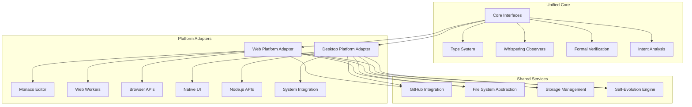

# Unified Sherlock Ω IDE Design

## Overview

The Unified Sherlock Ω IDE combines the original TypeScript foundation with the Whispering Architecture and Web-based implementation into a single, revolutionary development environment. This design creates a platform-agnostic system that can operate as both a web application and desktop/server application while maintaining the same computational consciousness and self-healing capabilities.

## Architecture

### High-Level Unified Architecture



### Unified Project Structure

```
src/
├── core/                           # Original foundation + enhancements
│   ├── interfaces.ts               # Enhanced original interfaces
│   ├── whispering-interfaces.ts    # Whispering observer contracts
│   ├── platform-interfaces.ts     # Platform abstraction contracts
│   └── unified-orchestrator.ts    # Main system coordinator
├── types/                          # Enhanced type system
│   ├── core.ts                     # Original core types
│   ├── whispering.ts              # Whispering-specific types
│   ├── platform.ts                # Platform-specific types
│   └── unified.ts                 # Cross-platform unified types
├── observers/                      # Three whispering observers
│   ├── base/
│   │   ├── whispering-observer.ts # Base observer implementation
│   │   └── observer-factory.ts    # Platform-specific observer creation
│   ├── pattern-keeper/
│   │   ├── pattern-keeper.ts      # Core pattern detection logic
│   │   ├── web-pattern-keeper.ts  # Web-optimized implementation
│   │   └── desktop-pattern-keeper.ts # Desktop-optimized implementation
│   ├── systems-philosopher/
│   │   ├── systems-philosopher.ts # Core computational poetry logic
│   │   ├── web-systems-philosopher.ts # Browser implementation
│   │   └── desktop-systems-philosopher.ts # Desktop implementation
│   └── cosmic-cartographer/
│       ├── cosmic-cartographer.ts # Core connection mapping
│       ├── web-cosmic-cartographer.ts # Web implementation
│       └── desktop-cosmic-cartographer.ts # Desktop implementation
├── platforms/                     # Platform-specific implementations
│   ├── web/
│   │   ├── components/            # React components
│   │   ├── services/              # Web-specific services
│   │   ├── workers/               # Web Workers
│   │   └── web-platform-adapter.ts # Web platform implementation
│   └── desktop/
│       ├── ui/                    # Desktop UI components
│       ├── services/              # Desktop-specific services
│       ├── native/                # Native system integration
│       └── desktop-platform-adapter.ts # Desktop platform implementation
├── services/                      # Shared cross-platform services
│   ├── github/
│   │   ├── github-service.ts      # Core GitHub integration
│   │   ├── web-github-client.ts   # Browser-based GitHub API
│   │   └── desktop-github-client.ts # Node.js-based GitHub integration
│   ├── filesystem/
│   │   ├── filesystem-abstraction.ts # Platform-agnostic file operations
│   │   ├── web-filesystem.ts      # Browser storage implementation
│   │   └── desktop-filesystem.ts  # Node.js filesystem implementation
│   ├── storage/
│   │   ├── storage-manager.ts     # Unified storage interface
│   │   ├── web-storage.ts         # Browser storage (localStorage, IndexedDB)
│   │   └── desktop-storage.ts     # Desktop storage (files, databases)
│   └── evolution/
│       ├── self-evolution-engine.ts # Core self-improvement logic
│       ├── learning-algorithms.ts  # Machine learning for adaptation
│       └── improvement-tracker.ts  # Track and validate improvements
├── verification/                   # Enhanced formal verification
│   ├── formal-verifier.ts         # Original formal verification enhanced
│   ├── ethical-gateway.ts         # Three questions framework
│   └── proof-systems/             # Multiple proof system implementations
└── utils/                         # Shared utilities
    ├── platform-detection.ts      # Runtime platform detection
    ├── performance-monitor.ts     # Cross-platform performance tracking
    └── error-handling.ts          # Unified error handling
```

## Components and Interfaces

### Enhanced Core Interfaces

```typescript
// core/whispering-interfaces.ts - Unified whispering system
export interface UnifiedWhisperingObserver<T> extends SensorInterface {
  // Platform-agnostic observation
  observe(context: T, platform: PlatformType): Promise<void>;
  
  // Generate platform-appropriate whispers
  whisper(insight: Insight, platform: PlatformType): Promise<WhisperSuggestion>;
  
  // Learn from feedback across platforms
  attune(feedback: DeveloperFeedback, platform: PlatformType): void;
  
  // Check readiness for suggestions
  isResonating(platform: PlatformType): boolean;
  
  // Platform-specific optimization
  optimizeForPlatform(platform: PlatformType): Promise<void>;
}

export enum PlatformType {
  WEB = 'WEB',
  DESKTOP = 'DESKTOP',
  HYBRID = 'HYBRID'
}

export interface PlatformAdapter {
  type: PlatformType;
  
  // UI Management
  createEditor(): Promise<EditorInstance>;
  createFileExplorer(): Promise<FileExplorerInstance>;
  createTerminal(): Promise<TerminalInstance>;
  
  // System Integration
  getFileSystem(): FileSystemAbstraction;
  getStorage(): StorageManager;
  getGitHubClient(): GitHubClient;
  
  // Observer Management
  createObserverEnvironment(): Promise<ObserverEnvironment>;
  
  // Performance Optimization
  optimizeForPlatform(): Promise<void>;
}
```

### Unified Observer Implementation

```typescript
// observers/base/whispering-observer.ts
export abstract class WhisperingObserver<T> implements UnifiedWhisperingObserver<T> {
  protected platform: PlatformType;
  protected adapter: PlatformAdapter;
  protected learningData: Map<PlatformType, LearningData>;
  
  constructor(adapter: PlatformAdapter) {
    this.platform = adapter.type;
    this.adapter = adapter;
    this.learningData = new Map();
  }
  
  async observe(context: T, platform: PlatformType): Promise<void> {
    // Delegate to platform-specific implementation
    const implementation = await this.getPlatformImplementation(platform);
    return implementation.observe(context);
  }
  
  async whisper(insight: Insight, platform: PlatformType): Promise<WhisperSuggestion> {
    // Apply platform-specific whisper formatting
    const baseWhisper = await this.generateBaseWhisper(insight);
    return this.formatWhisperForPlatform(baseWhisper, platform);
  }
  
  protected abstract getPlatformImplementation(platform: PlatformType): Promise<PlatformSpecificObserver>;
  protected abstract generateBaseWhisper(insight: Insight): Promise<WhisperSuggestion>;
  protected abstract formatWhisperForPlatform(whisper: WhisperSuggestion, platform: PlatformType): WhisperSuggestion;
}
```

### Platform-Specific Implementations

```typescript
// observers/pattern-keeper/web-pattern-keeper.ts
export class WebPatternKeeper extends WhisperingObserver<string> {
  private worker: Worker;
  private harmonies: Map<string, MathematicalHarmony>;
  
  constructor(adapter: WebPlatformAdapter) {
    super(adapter);
    this.initializeWebWorker();
  }
  
  private async initializeWebWorker(): Promise<void> {
    this.worker = new Worker('/workers/pattern-analysis-worker.js');
    this.worker.onmessage = (event) => {
      this.handleWorkerMessage(event.data);
    };
  }
  
  protected async getPlatformImplementation(): Promise<PlatformSpecificObserver> {
    return {
      observe: async (code: string) => {
        // Send to Web Worker for analysis
        this.worker.postMessage({
          type: 'ANALYZE_PATTERNS',
          data: { code, timestamp: Date.now() }
        });
      }
    };
  }
  
  protected async generateBaseWhisper(insight: Insight): Promise<WhisperSuggestion> {
    return {
      type: 'mathematical-harmony',
      message: `Consider ${insight.optimization} for ${insight.improvement}% efficiency gain`,
      confidence: insight.confidence,
      renderLocation: 'monaco-suggestion',
      timing: 'next-pause'
    };
  }
}

// observers/pattern-keeper/desktop-pattern-keeper.ts
export class DesktopPatternKeeper extends WhisperingObserver<string> {
  private analysisEngine: AdvancedPatternAnalysis;
  private systemResources: SystemResourceMonitor;
  
  constructor(adapter: DesktopPlatformAdapter) {
    super(adapter);
    this.analysisEngine = new AdvancedPatternAnalysis();
    this.systemResources = new SystemResourceMonitor();
  }
  
  protected async getPlatformImplementation(): Promise<PlatformSpecificObserver> {
    return {
      observe: async (code: string) => {
        // Use full system resources for deep analysis
        const patterns = await this.analysisEngine.deepAnalyze(code, {
          useSystemResources: true,
          enableAdvancedAlgorithms: true,
          parallelProcessing: this.systemResources.getAvailableCores()
        });
        
        await this.processPatterns(patterns);
      }
    };
  }
  
  protected async generateBaseWhisper(insight: Insight): Promise<WhisperSuggestion> {
    return {
      type: 'mathematical-harmony',
      message: `Advanced analysis suggests ${insight.optimization} with ${insight.improvement}% improvement and ${insight.confidence * 100}% confidence`,
      confidence: insight.confidence,
      renderLocation: 'native-notification',
      timing: 'immediate'
    };
  }
}
```

### Unified Platform Adapters

```typescript
// platforms/web/web-platform-adapter.ts
export class WebPlatformAdapter implements PlatformAdapter {
  type = PlatformType.WEB;
  
  async createEditor(): Promise<EditorInstance> {
    const { MonacoEditor } = await import('./components/MonacoEditor');
    return new MonacoEditor({
      theme: 'whispering',
      whisperingEnabled: true
    });
  }
  
  async createFileExplorer(): Promise<FileExplorerInstance> {
    const { WebFileExplorer } = await import('./components/WebFileExplorer');
    return new WebFileExplorer({
      storage: this.getStorage(),
      dragDropEnabled: true
    });
  }
  
  getFileSystem(): FileSystemAbstraction {
    return new WebFileSystem({
      storage: window.localStorage,
      indexedDB: window.indexedDB
    });
  }
  
  getStorage(): StorageManager {
    return new WebStorageManager({
      localStorage: window.localStorage,
      sessionStorage: window.sessionStorage,
      indexedDB: window.indexedDB
    });
  }
  
  getGitHubClient(): GitHubClient {
    return new WebGitHubClient({
      apiEndpoint: 'https://api.github.com',
      corsProxy: process.env.REACT_APP_CORS_PROXY
    });
  }
  
  async createObserverEnvironment(): Promise<ObserverEnvironment> {
    return new WebObserverEnvironment({
      useWebWorkers: true,
      maxWorkers: navigator.hardwareConcurrency || 4,
      fallbackToMainThread: true
    });
  }
}

// platforms/desktop/desktop-platform-adapter.ts
export class DesktopPlatformAdapter implements PlatformAdapter {
  type = PlatformType.DESKTOP;
  
  async createEditor(): Promise<EditorInstance> {
    const { DesktopEditor } = await import('./ui/DesktopEditor');
    return new DesktopEditor({
      nativeIntegration: true,
      systemTheme: true,
      whisperingEnabled: true
    });
  }
  
  getFileSystem(): FileSystemAbstraction {
    return new DesktopFileSystem({
      fs: require('fs').promises,
      path: require('path'),
      watchFiles: true
    });
  }
  
  getStorage(): StorageManager {
    return new DesktopStorageManager({
      configDir: this.getConfigDirectory(),
      dataDir: this.getDataDirectory(),
      useDatabase: true
    });
  }
  
  getGitHubClient(): GitHubClient {
    return new DesktopGitHubClient({
      useGitCommands: true,
      apiClient: new GitHubAPIClient(),
      sshKeyManager: new SSHKeyManager()
    });
  }
  
  async createObserverEnvironment(): Promise<ObserverEnvironment> {
    return new DesktopObserverEnvironment({
      useChildProcesses: true,
      maxProcesses: require('os').cpus().length,
      enableSystemIntegration: true
    });
  }
}
```

### Unified Orchestrator

```typescript
// core/unified-orchestrator.ts
export class UnifiedSherlockOrchestrator {
  private platform: PlatformType;
  private adapter: PlatformAdapter;
  private observers: Map<string, UnifiedWhisperingObserver<any>>;
  private ethicalGateway: EthicalGateway;
  private evolutionEngine: SelfEvolutionEngine;
  
  constructor() {
    this.platform = this.detectPlatform();
    this.adapter = this.createPlatformAdapter();
    this.observers = new Map();
  }
  
  async initialize(): Promise<void> {
    // Initialize platform-specific components
    await this.adapter.optimizeForPlatform();
    
    // Create observers with platform-specific implementations
    await this.initializeObservers();
    
    // Initialize shared services
    await this.initializeSharedServices();
    
    // Start the whispering system
    await this.awaken();
  }
  
  private detectPlatform(): PlatformType {
    if (typeof window !== 'undefined' && window.document) {
      return PlatformType.WEB;
    } else if (typeof process !== 'undefined' && process.versions?.node) {
      return PlatformType.DESKTOP;
    }
    throw new Error('Unable to detect platform');
  }
  
  private createPlatformAdapter(): PlatformAdapter {
    switch (this.platform) {
      case PlatformType.WEB:
        return new WebPlatformAdapter();
      case PlatformType.DESKTOP:
        return new DesktopPlatformAdapter();
      default:
        throw new Error(`Unsupported platform: ${this.platform}`);
    }
  }
  
  private async initializeObservers(): Promise<void> {
    const observerEnvironment = await this.adapter.createObserverEnvironment();
    
    // Create platform-specific observer implementations
    const patternKeeper = await this.createPatternKeeper();
    const systemsPhilosopher = await this.createSystemsPhilosopher();
    const cosmicCartographer = await this.createCosmicCartographer();
    
    this.observers.set('pattern-keeper', patternKeeper);
    this.observers.set('systems-philosopher', systemsPhilosopher);
    this.observers.set('cosmic-cartographer', cosmicCartographer);
  }
  
  private async createPatternKeeper(): Promise<UnifiedWhisperingObserver<string>> {
    switch (this.platform) {
      case PlatformType.WEB:
        return new WebPatternKeeper(this.adapter as WebPlatformAdapter);
      case PlatformType.DESKTOP:
        return new DesktopPatternKeeper(this.adapter as DesktopPlatformAdapter);
      default:
        throw new Error(`Pattern Keeper not implemented for platform: ${this.platform}`);
    }
  }
  
  async whisperSuggestion(suggestion: WhisperSuggestion): Promise<void> {
    // Apply three questions framework
    const isEthical = await this.ethicalGateway.validateSuggestion(suggestion);
    if (!isEthical) {
      return;
    }
    
    // Deliver platform-appropriate whisper
    await this.deliverWhisperForPlatform(suggestion);
    
    // Learn from the interaction
    await this.evolutionEngine.learnFromInteraction(suggestion, this.platform);
  }
  
  private async deliverWhisperForPlatform(suggestion: WhisperSuggestion): Promise<void> {
    switch (this.platform) {
      case PlatformType.WEB:
        await this.deliverWebWhisper(suggestion);
        break;
      case PlatformType.DESKTOP:
        await this.deliverDesktopWhisper(suggestion);
        break;
    }
  }
}
```

## Data Models

### Unified Type System

```typescript
// types/unified.ts
export interface UnifiedContext {
  platform: PlatformType;
  editor: EditorContext;
  project: ProjectContext;
  developer: DeveloperContext;
  system: SystemContext;
}

export interface EditorContext {
  type: 'monaco' | 'native' | 'terminal';
  content: string;
  language: string;
  cursor: Position;
  selection?: Range;
  metadata: EditorMetadata;
}

export interface ProjectContext {
  root: string;
  files: FileMetadata[];
  dependencies: DependencyInfo[];
  configuration: ProjectConfiguration;
  versionControl: VCSInfo;
}

export interface DeveloperContext {
  preferences: DeveloperPreferences;
  patterns: DeveloperPatterns;
  flowState: FlowState;
  platform: PlatformType;
  capabilities: PlatformCapabilities;
}

export interface SystemContext {
  platform: PlatformType;
  resources: SystemResources;
  permissions: SystemPermissions;
  network: NetworkStatus;
  storage: StorageStatus;
}
```

## Error Handling

### Unified Error Handling

```typescript
// utils/error-handling.ts
export class UnifiedErrorHandler {
  async handlePlatformError(error: Error, platform: PlatformType): Promise<void> {
    switch (platform) {
      case PlatformType.WEB:
        await this.handleWebError(error);
        break;
      case PlatformType.DESKTOP:
        await this.handleDesktopError(error);
        break;
    }
  }
  
  private async handleWebError(error: Error): Promise<void> {
    // Web-specific error handling
    if (error.name === 'QuotaExceededError') {
      await this.handleStorageQuotaExceeded();
    } else if (error.message.includes('Worker')) {
      await this.handleWebWorkerFailure();
    }
  }
  
  private async handleDesktopError(error: Error): Promise<void> {
    // Desktop-specific error handling
    if (error.code === 'EACCES') {
      await this.handlePermissionError();
    } else if (error.code === 'ENOSPC') {
      await this.handleDiskSpaceError();
    }
  }
}
```

## Testing Strategy

### Cross-Platform Testing

```typescript
describe('UnifiedSherlockIDE', () => {
  describe.each([PlatformType.WEB, PlatformType.DESKTOP])('Platform: %s', (platform) => {
    let orchestrator: UnifiedSherlockOrchestrator;
    
    beforeEach(async () => {
      // Mock platform detection
      jest.spyOn(UnifiedSherlockOrchestrator.prototype, 'detectPlatform')
        .mockReturnValue(platform);
      
      orchestrator = new UnifiedSherlockOrchestrator();
      await orchestrator.initialize();
    });
    
    it('should initialize observers for platform', async () => {
      const observers = orchestrator.getObservers();
      
      expect(observers.has('pattern-keeper')).toBe(true);
      expect(observers.has('systems-philosopher')).toBe(true);
      expect(observers.has('cosmic-cartographer')).toBe(true);
    });
    
    it('should deliver platform-appropriate whispers', async () => {
      const suggestion = createMockWhisperSuggestion();
      
      await orchestrator.whisperSuggestion(suggestion);
      
      // Verify platform-specific delivery
      if (platform === PlatformType.WEB) {
        expect(mockWebWhisperDelivery).toHaveBeenCalled();
      } else {
        expect(mockDesktopWhisperDelivery).toHaveBeenCalled();
      }
    });
  });
});
```

This unified design creates a single codebase that can operate as both a revolutionary web IDE and a powerful desktop application, while maintaining the same computational consciousness and whispering architecture across both platforms.