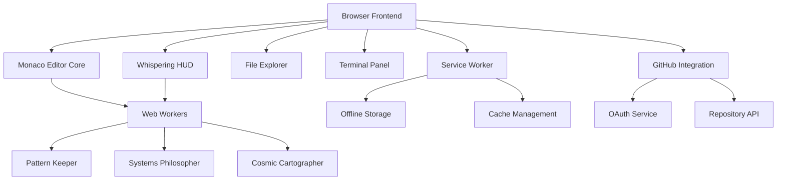

# Web-Based Sherlock IDE Design

## Overview

The Web-Based Sherlock IDE transforms the Whispering Architecture into an immediately accessible browser application. Using Monaco Editor as the foundation, it creates a familiar VS Code-like experience while awakening the three observers (Pattern Keeper, Systems Philosopher, Cosmic Cartographer) in the web environment.

## Architecture

### High-Level System Architecture



### Frontend Architecture (React + TypeScript)

```
frontend/
├── components/
│   ├── editor/
│   │   ├── MonacoEditor.tsx        # Core editor with whisper integration
│   │   ├── WhisperingHUD.tsx       # Gentle insight overlay
│   │   └── SuggestionWidget.tsx    # Enhanced Monaco suggestions
│   ├── explorer/
│   │   ├── FileExplorer.tsx        # Project navigation
│   │   ├── FileTree.tsx            # Hierarchical file display
│   │   └── ProjectManager.tsx      # Project operations
│   ├── terminal/
│   │   ├── TerminalPanel.tsx       # xterm.js integration
│   │   └── CommandProcessor.tsx    # Web-based command execution
│   └── layout/
│       ├── IDELayout.tsx           # Main application layout
│       └── PanelManager.tsx        # Resizable panel system
├── observers/
│   ├── PatternKeeper.ts            # Mathematical harmonies detector
│   ├── SystemsPhilosopher.ts       # Computational poetry analyzer
│   ├── CosmicCartographer.ts       # Cross-dimensional connections
│   └── WhisperingOrchestrator.ts   # Observer coordination
├── services/
│   ├── FileSystemService.ts        # Browser-based file operations
│   ├── GitHubService.ts            # Repository integration
│   ├── StorageService.ts           # Local/session storage management
│   └── WorkerManager.ts            # Web Worker coordination
└── workers/
    ├── pattern-worker.ts           # Pattern analysis in background
    ├── analysis-worker.ts          # Code analysis without UI blocking
    └── evolution-worker.ts         # Self-improvement processing
```

## Components and Interfaces

### Monaco Editor Integration

```typescript
// MonacoEditor.tsx - The foundation with whispering capability
interface WhisperingEditorProps {
  onWhisper?: (insight: Insight) => void;
  onCodeChange?: (code: string, filePath: string) => void;
  theme?: 'light' | 'dark' | 'whispering';
}

export const MonacoEditor: React.FC<WhisperingEditorProps> = ({
  onWhisper,
  onCodeChange,
  theme = 'whispering'
}) => {
  const editorRef = useRef<monaco.editor.IStandaloneCodeEditor>();
  const observersRef = useRef<WhisperingOrchestrator>();

  const handleEditorDidMount = (
    editor: monaco.editor.IStandaloneCodeEditor,
    monaco: typeof import('monaco-editor')
  ) => {
    editorRef.current = editor;
    
    // Initialize whispering theme
    monaco.editor.defineTheme('whispering', {
      base: 'vs-dark',
      inherit: true,
      rules: [
        { token: 'whisper-suggestion', foreground: '88C0D0', fontStyle: 'italic' },
        { token: 'harmony-pattern', foreground: 'A3BE8C', fontStyle: 'bold' }
      ],
      colors: {
        'editor.background': '#2E3440',
        'whisper.suggestion': '#88C0D0',
        'harmony.highlight': '#A3BE8C'
      }
    });

    // Initialize whispering orchestrator
    observersRef.current = new WhisperingOrchestrator({
      onWhisper,
      editor,
      monaco
    });

    // Listen for code changes
    editor.onDidChangeModelContent((e) => {
      const code = editor.getValue();
      const model = editor.getModel();
      const filePath = model?.uri.path || '';
      
      onCodeChange?.(code, filePath);
      observersRef.current?.observe(code, filePath, e);
    });

    // Enhanced suggestion provider
    monaco.languages.registerCompletionItemProvider('typescript', {
      provideCompletionItems: async (model, position) => {
        const whispers = await observersRef.current?.getWhispersForPosition(
          model, 
          position
        );
        
        return {
          suggestions: [
            ...getStandardSuggestions(model, position),
            ...whispers?.map(whisper => ({
              label: whisper.suggestion,
              kind: monaco.languages.CompletionItemKind.Snippet,
              detail: `🌙 ${whisper.type}`,
              documentation: whisper.explanation,
              insertText: whisper.code,
              range: whisper.range
            })) || []
          ]
        };
      }
    });
  };

  return (
    <Editor
      height="100%"
      defaultLanguage="typescript"
      theme={theme}
      onMount={handleEditorDidMount}
      options={{
        minimap: { enabled: false },
        fontSize: 14,
        fontFamily: 'JetBrains Mono, Consolas, monospace',
        lineNumbers: 'on',
        roundedSelection: false,
        scrollBeyondLastLine: false,
        automaticLayout: true,
        suggestOnTriggerCharacters: true,
        quickSuggestions: true,
        wordBasedSuggestions: false,
        // Whispering-specific options
        renderWhitespace: 'selection',
        cursorBlinking: 'smooth',
        cursorSmoothCaretAnimation: true
      }}
    />
  );
};
```

### Whispering HUD Component

```typescript
// WhisperingHUD.tsx - Gentle insight overlay
interface WhisperingHUDProps {
  insights: Insight[];
  onDismiss: (insightId: string) => void;
  onAccept: (insightId: string) => void;
  developerState: DeveloperState;
}

export const WhisperingHUD: React.FC<WhisperingHUDProps> = ({
  insights,
  onDismiss,
  onAccept,
  developerState
}) => {
  const [visibleInsights, setVisibleInsights] = useState<Insight[]>([]);
  const [whisperQueue, setWhisperQueue] = useState<Insight[]>([]);

  useEffect(() => {
    // Respect developer's flow state
    if (developerState.flowState === 'deep-focus') {
      setWhisperQueue(prev => [...prev, ...insights]);
      return;
    }

    // Show insights gently during receptive moments
    if (developerState.attentionLevel > 0.6) {
      setVisibleInsights(insights.slice(0, 2)); // Max 2 at a time
    }
  }, [insights, developerState]);

  return (
    <div className="whispering-hud">
      <AnimatePresence>
        {visibleInsights.map(insight => (
          <motion.div
            key={insight.id}
            initial={{ opacity: 0, y: 20, scale: 0.9 }}
            animate={{ opacity: 1, y: 0, scale: 1 }}
            exit={{ opacity: 0, y: -20, scale: 0.9 }}
            transition={{ duration: 0.3, ease: 'easeOut' }}
            className={`whisper-card whisper-${insight.type}`}
          >
            <div className="whisper-header">
              <span className="whisper-icon">
                {getObserverIcon(insight.observer)}
              </span>
              <span className="whisper-title">
                {insight.title}
              </span>
              <span className="whisper-confidence">
                {Math.round(insight.confidence * 100)}%
              </span>
            </div>
            
            <div className="whisper-content">
              {insight.message}
            </div>
            
            <div className="whisper-actions">
              <button 
                onClick={() => onAccept(insight.id)}
                className="whisper-accept"
              >
                Apply
              </button>
              <button 
                onClick={() => onDismiss(insight.id)}
                className="whisper-dismiss"
              >
                Later
              </button>
            </div>
          </motion.div>
        ))}
      </AnimatePresence>
      
      {whisperQueue.length > 0 && (
        <div className="whisper-queue-indicator">
          <span>{whisperQueue.length} insights waiting</span>
          <button onClick={() => setVisibleInsights(whisperQueue.splice(0, 2))}>
            Show
          </button>
        </div>
      )}
    </div>
  );
};
```

### Web Worker Observers

```typescript
// pattern-worker.ts - Pattern analysis in background thread
import { PatternKeeper } from '../observers/PatternKeeper';

const patternKeeper = new PatternKeeper();

self.onmessage = async (event) => {
  const { type, data } = event.data;
  
  switch (type) {
    case 'ANALYZE_CODE':
      const { code, filePath, timestamp } = data;
      
      try {
        const patterns = await patternKeeper.analyzePatterns(code, filePath);
        const harmonies = await patternKeeper.detectHarmonies(patterns);
        
        self.postMessage({
          type: 'PATTERNS_DETECTED',
          data: {
            patterns,
            harmonies,
            timestamp,
            filePath
          }
        });
      } catch (error) {
        self.postMessage({
          type: 'ANALYSIS_ERROR',
          data: { error: error.message, timestamp, filePath }
        });
      }
      break;
      
    case 'UPDATE_PREFERENCES':
      await patternKeeper.updatePreferences(data.preferences);
      break;
      
    case 'LEARN_FROM_FEEDBACK':
      await patternKeeper.learnFromFeedback(data.feedback);
      break;
  }
};
```

### Progressive Web App Configuration

```typescript
// service-worker.ts - Offline capability and caching
const CACHE_NAME = 'sherlock-ide-v1';
const STATIC_ASSETS = [
  '/',
  '/static/js/bundle.js',
  '/static/css/main.css',
  '/monaco-editor/min/vs/loader.js',
  '/monaco-editor/min/vs/editor/editor.main.js'
];

self.addEventListener('install', (event) => {
  event.waitUntil(
    caches.open(CACHE_NAME)
      .then(cache => cache.addAll(STATIC_ASSETS))
  );
});

self.addEventListener('fetch', (event) => {
  // Cache-first strategy for static assets
  if (event.request.url.includes('/static/') || 
      event.request.url.includes('/monaco-editor/')) {
    event.respondWith(
      caches.match(event.request)
        .then(response => response || fetch(event.request))
    );
    return;
  }
  
  // Network-first for API calls
  if (event.request.url.includes('/api/')) {
    event.respondWith(
      fetch(event.request)
        .catch(() => caches.match(event.request))
    );
    return;
  }
  
  // Default: try network, fallback to cache
  event.respondWith(
    fetch(event.request)
      .catch(() => caches.match(event.request))
  );
});
```

## Data Models

### Web-Specific Types

```typescript
// Web environment adaptations of core types
interface WebObservationContext extends ObservationContext {
  browserInfo: {
    userAgent: string;
    viewport: { width: number; height: number };
    performance: PerformanceMetrics;
  };
  editorState: {
    cursorPosition: monaco.Position;
    selection: monaco.Selection;
    visibleRange: monaco.Range;
    scrollPosition: number;
  };
  fileContext: {
    openFiles: string[];
    activeFile: string;
    unsavedChanges: boolean;
  };
}

interface WebWhisperSuggestion extends WhisperSuggestion {
  renderLocation: 'hud' | 'inline' | 'suggestion-widget' | 'status-bar';
  animation: 'fade' | 'slide' | 'pulse' | 'none';
  dismissible: boolean;
  autoHide: number; // milliseconds, 0 for manual dismiss
}

interface BrowserStorageState {
  projects: ProjectMetadata[];
  preferences: UserPreferences;
  observerLearning: ObserverLearningData;
  recentFiles: FileReference[];
  workspaceLayout: LayoutConfiguration;
}
```

## Error Handling

### Web-Specific Error Handling

```typescript
class WebIDEErrorHandler extends WhisperingErrorHandler {
  async handleWebWorkerFailure(workerType: string, error: Error): Promise<void> {
    // Gracefully degrade to main thread processing
    console.warn(`Web Worker ${workerType} failed, falling back to main thread:`, error);
    
    await this.enableMainThreadFallback(workerType);
    await this.notifyUser(`Background processing temporarily limited`, 'warning');
  }
  
  async handleStorageQuotaExceeded(error: DOMException): Promise<void> {
    // Intelligent cache management
    await this.clearOldCacheEntries();
    await this.compressStoredData();
    await this.notifyUser('Storage optimized to free up space', 'info');
  }
  
  async handleOfflineMode(): Promise<void> {
    // Disable GitHub integration, enable local-only mode
    await this.switchToOfflineMode();
    await this.notifyUser('Working offline - GitHub features disabled', 'info');
  }
}
```

## Testing Strategy

### Web-Specific Testing

```typescript
describe('WebIDEIntegration', () => {
  it('should initialize Monaco Editor with whispering capabilities', async () => {
    const { container } = render(<MonacoEditor onWhisper={mockWhisperHandler} />);
    
    await waitFor(() => {
      expect(container.querySelector('.monaco-editor')).toBeInTheDocument();
    });
    
    // Test whispering integration
    const editor = getMonacoInstance();
    editor.setValue('const test = "hello world";');
    
    await waitFor(() => {
      expect(mockWhisperHandler).toHaveBeenCalledWith(
        expect.objectContaining({
          type: 'pattern-suggestion',
          confidence: expect.any(Number)
        })
      );
    });
  });
  
  it('should work offline with service worker', async () => {
    // Simulate offline mode
    Object.defineProperty(navigator, 'onLine', { value: false });
    
    const { container } = render(<IDELayout />);
    
    await waitFor(() => {
      expect(container.querySelector('.offline-indicator')).toBeInTheDocument();
    });
    
    // Should still allow local file operations
    const fileExplorer = container.querySelector('.file-explorer');
    fireEvent.click(fileExplorer.querySelector('.create-file-button'));
    
    expect(container.querySelector('.new-file-dialog')).toBeInTheDocument();
  });
  
  it('should handle Web Worker failures gracefully', async () => {
    // Mock Web Worker failure
    jest.spyOn(Worker.prototype, 'postMessage').mockImplementation(() => {
      throw new Error('Worker failed');
    });
    
    const { container } = render(<MonacoEditor />);
    
    // Should fall back to main thread processing
    await waitFor(() => {
      expect(container.querySelector('.fallback-processing-indicator')).toBeInTheDocument();
    });
  });
});
```

## Performance Considerations

### Web Performance Optimization

- **Code Splitting**: Lazy load observers and advanced features
- **Web Workers**: All heavy analysis runs in background threads
- **Virtual Scrolling**: Handle large files efficiently in file explorer
- **Debounced Analysis**: Limit observer frequency during rapid typing
- **Intelligent Caching**: Cache analysis results with smart invalidation
- **Progressive Loading**: Load Monaco Editor and features incrementally

### Memory Management

```typescript
class WebMemoryManager {
  private observerCache = new Map<string, WeakRef<any>>();
  private analysisResults = new LRUCache<string, AnalysisResult>(100);
  
  async optimizeMemoryUsage(): Promise<void> {
    // Clean up weak references
    for (const [key, ref] of this.observerCache) {
      if (!ref.deref()) {
        this.observerCache.delete(key);
      }
    }
    
    // Compress old analysis results
    await this.compressOldAnalysis();
    
    // Request garbage collection if available
    if ('gc' in window) {
      (window as any).gc();
    }
  }
}
```

This design creates an immediately usable web IDE that can gently awaken into the full Whispering Architecture, providing a smooth evolution path from basic editor to revolutionary self-building system.