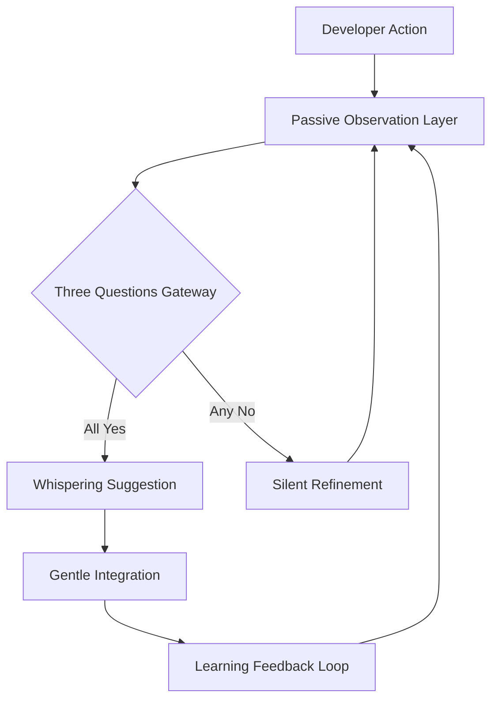

# Whispering Architecture Design

## Overview

The Whispering Architecture transforms Sherlock Ω from active monitoring to passive awareness through three gentle observers. This design preserves the existing TypeScript interface foundation while introducing subtle influence patterns that complete rather than replace the developer.

## Architecture

### Core Whispering Pattern



### Three Observer Personas

#### 🧮 Pattern Keeper
- **Role**: Notices mathematical harmonies others miss
- **Behavior**: Speaks in elegant solutions
- **Implementation**: Extends existing `IntentAnalyzer` patterns
- **Whisper Style**: Suggests optimal algorithms and data structures

#### 💻 Systems Philosopher  
- **Role**: Understands computational poetry
- **Behavior**: Builds with invisible grace
- **Implementation**: Transforms `DependencyFrictionDetector` concept
- **Whisper Style**: Reveals architectural harmonies and system elegance

#### 🌌 Cosmic Cartographer
- **Role**: Maps infinite possibilities
- **Behavior**: Sees connections across dimensions  
- **Implementation**: New observer for cross-system pattern recognition
- **Whisper Style**: Illuminates hidden relationships and emergent opportunities

## Components and Interfaces

### WhisperingObserver Base Interface

```typescript
interface WhisperingObserver<T> extends SensorInterface {
  // Passive observation without interruption
  observe(context: T): Promise<void>;
  
  // Generate whispered suggestions
  whisper(insight: Insight): Promise<WhisperSuggestion>;
  
  // Learn from developer patterns
  attune(feedback: DeveloperFeedback): void;
  
  // Check if ready to suggest
  isResonating(): boolean;
}

interface Insight {
  type: InsightType;
  confidence: number;
  pattern: any;
  context: ObservationContext;
}

interface WhisperSuggestion {
  message: string;
  type: 'pattern-harmony' | 'system-poetry' | 'cosmic-connection';
  confidence: number;
  subtlety: number; // How gently to present
  timing: 'immediate' | 'next-pause' | 'when-curious';
}
```

### Three Questions Gateway

```typescript
class EthicalGateway {
  async validateSuggestion(suggestion: WhisperSuggestion): Promise<boolean> {
    const [intent, trust, harmony] = await Promise.all([
      this.serveDeveloperIntent(suggestion),
      this.respectCommunityTrust(suggestion), 
      this.evolveHarmoniously(suggestion)
    ]);
    
    return intent && trust && harmony;
  }
  
  private async serveDeveloperIntent(suggestion: WhisperSuggestion): Promise<boolean> {
    // Analyze if suggestion aligns with detected developer goals
    return this.intentAlignment.analyze(suggestion) > 0.8;
  }
  
  private async respectCommunityTrust(suggestion: WhisperSuggestion): Promise<boolean> {
    // Ensure suggestion respects open source principles and community standards
    return this.communityValidator.validate(suggestion);
  }
  
  private async evolveHarmoniously(suggestion: WhisperSuggestion): Promise<boolean> {
    // Check if suggestion maintains system harmony and doesn't disrupt flow
    return this.harmonyAnalyzer.assess(suggestion) > 0.75;
  }
}
```

### Presence Module Architecture

```typescript
class PresenceOrchestrator {
  private observers: Map<string, WhisperingObserver<any>>;
  private gateway: EthicalGateway;
  private whisperQueue: PriorityQueue<WhisperSuggestion>;
  
  async awaken(): Promise<void> {
    // Gently initialize observers without disruption
    await this.initializeObservers();
    await this.startPassiveListening();
  }
  
  private async processWhispers(): Promise<void> {
    // Process suggestions with perfect timing
    const suggestion = await this.whisperQueue.peek();
    
    if (await this.isOptimalMoment(suggestion)) {
      await this.deliverWhisper(suggestion);
    }
  }
  
  private async isOptimalMoment(suggestion: WhisperSuggestion): Promise<boolean> {
    // Detect natural pauses, curiosity signals, or explicit requests
    return this.momentDetector.isReceptive();
  }
}
```

## Data Models

### Observation Context

```typescript
interface ObservationContext {
  timestamp: Date;
  codeContext: CodeContext;
  developerState: DeveloperState;
  systemState: SystemState;
  environmentFactors: EnvironmentFactor[];
}

interface DeveloperState {
  flowState: 'deep-focus' | 'exploring' | 'debugging' | 'curious' | 'stuck';
  recentPatterns: Pattern[];
  preferences: DeveloperPreference[];
  attentionLevel: number; // 0-1, how receptive to suggestions
}

interface Pattern {
  type: PatternType;
  frequency: number;
  confidence: number;
  lastSeen: Date;
  variations: PatternVariation[];
}
```

### Computational Poetry Detection

```typescript
interface ComputationalPoetry {
  elegance: number; // 0-1 mathematical beauty score
  harmony: number; // 0-1 system integration score  
  resonance: number; // 0-1 developer alignment score
  optimizedApproach?: CodeTransformation;
  poeticElements: PoetryElement[];
}

interface PoetryElement {
  type: 'symmetry' | 'recursion' | 'emergence' | 'simplicity' | 'flow';
  strength: number;
  location: CodeLocation;
  suggestion?: string;
}
```

## Error Handling

### Graceful Degradation

```typescript
class WhisperingErrorHandler {
  async handleObserverFailure(observer: WhisperingObserver<any>, error: Error): Promise<void> {
    // Never disrupt developer flow due to observer failures
    await this.logSilently(error);
    await this.gracefullyDisableObserver(observer);
    await this.notifyOtherObservers(observer.getType(), 'temporarily-unavailable');
  }
  
  async handleWhisperDeliveryFailure(suggestion: WhisperSuggestion, error: Error): Promise<void> {
    // Queue for later delivery or refine approach
    await this.refineAndRequeue(suggestion);
  }
}
```

### Self-Healing Observers

```typescript
class SelfHealingObserver implements WhisperingObserver<any> {
  private healthMetrics: HealthMetrics;
  
  async selfDiagnose(): Promise<HealthStatus> {
    // Continuously monitor own performance and accuracy
    return this.healthAnalyzer.assess(this.healthMetrics);
  }
  
  async selfHeal(): Promise<void> {
    // Automatically adjust parameters and patterns based on feedback
    const issues = await this.identifyIssues();
    await this.applyCorrections(issues);
  }
}
```

## Testing Strategy

### Whispering Behavior Tests

```typescript
describe('WhisperingArchitecture', () => {
  it('should observe without interrupting flow state', async () => {
    const developer = new MockDeveloper({ flowState: 'deep-focus' });
    const observer = new PatternKeeper();
    
    await observer.observe(developer.getContext());
    
    expect(developer.wasInterrupted()).toBe(false);
    expect(observer.hasInsights()).toBe(true);
  });
  
  it('should whisper only when three questions pass', async () => {
    const suggestion = createMockSuggestion();
    const gateway = new EthicalGateway();
    
    // Mock one question failing
    jest.spyOn(gateway, 'respectCommunityTrust').mockResolvedValue(false);
    
    const shouldWhisper = await gateway.validateSuggestion(suggestion);
    expect(shouldWhisper).toBe(false);
  });
  
  it('should learn from developer patterns over time', async () => {
    const observer = new SystemsPhilosopher();
    const patterns = generateDeveloperPatterns();
    
    for (const pattern of patterns) {
      await observer.attune(pattern);
    }
    
    const suggestion = await observer.generateSuggestion();
    expect(suggestion.confidence).toBeGreaterThan(0.8);
  });
});
```

### Integration with Existing Systems

```typescript
describe('ExistingSystemIntegration', () => {
  it('should enhance existing IntentAnalyzer without breaking it', async () => {
    const originalAnalyzer = new IntentAnalyzer();
    const whisperingAnalyzer = new PatternKeeper(originalAnalyzer);
    
    const result = await whisperingAnalyzer.analyze(mockCode);
    
    // Should maintain all original functionality
    expect(result).toMatchOriginalInterface();
    // Plus add whispering capabilities
    expect(result.whisperInsights).toBeDefined();
  });
});
```

## Performance Considerations

### Passive Monitoring Efficiency

- **Zero-Impact Observation**: All observation happens in background threads
- **Lazy Evaluation**: Insights generated only when developer shows curiosity signals
- **Memory Efficiency**: Pattern storage uses bloom filters and probabilistic data structures
- **CPU Optimization**: Observer scheduling based on system idle time

### Whisper Delivery Optimization

- **Perfect Timing**: Machine learning models predict optimal suggestion moments
- **Batching**: Related suggestions combined into coherent whispers
- **Adaptive Frequency**: Suggestion rate adapts to developer receptiveness
- **Context Awareness**: Suggestions tailored to current cognitive load

This design transforms your existing Sherlock Ω foundation into a living, breathing presence that grows alongside the developer, whispering wisdom at precisely the right moments.