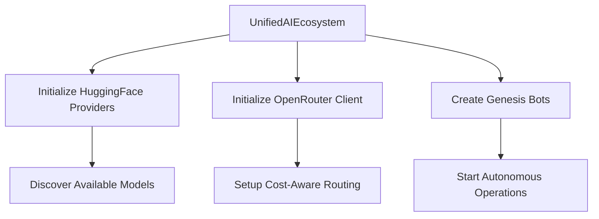
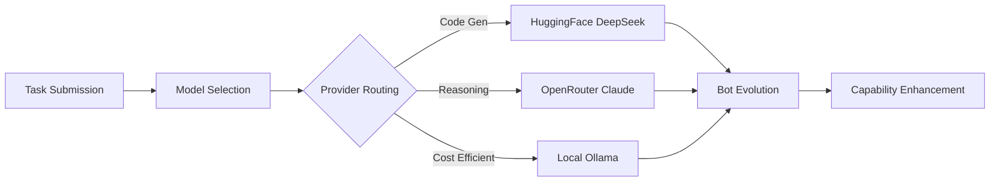
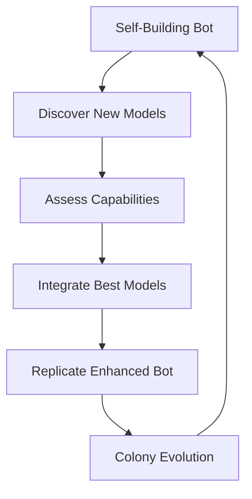

# 🌟 AI Ecosystem Alignment: Self-Building + HuggingFace + OpenRouter

## 🎯 Comprehensive Integration Overview

This document details how we've successfully aligned the **self-building AI concept** with **HuggingFace** and **OpenRouter** integrations to create a unified, autonomous AI ecosystem.

## 🔍 What We Found: Existing Self-Building AI Implementation

The Sherlock Ω IDE already had sophisticated self-building AI capabilities:

### **Core Self-Building Components**
- [`SelfBuildingBot`](./src/ai/self-building-bot.ts) - Autonomous bots with replication and evolution
- [`BotManager`](./src/ai/bot-manager.ts) - Bot colony orchestration  
- [`EvolutionController`](./src/core/evolution-controller.ts) - Autonomous evolution engine
- [`AutonomousCompiler`](./src/core/autonomous-compiler.ts) - Self-compilation capabilities

### **Existing AI Integrations**
- [`OpenRouterAI`](./src/ai/openrouter-integration.ts) - Complete OpenRouter implementation
- [`HuggingFaceService`](./sherlock-web-ide/src/services/HuggingFaceIntegration.ts) - HuggingFace model access
- [`CostAwareOrchestrator`](./src/ai/cost-aware-orchestrator.ts) - Cost optimization

## 🚀 What We've Built: Unified AI Ecosystem

### **New Integration Layer**

#### 1. **Unified AI Ecosystem** [`unified-ai-ecosystem.ts`](./src/ai/unified-ai-ecosystem.ts)
```typescript
class UnifiedAIEcosystem {
  // Combines self-building bots with HuggingFace and OpenRouter
  // Provides autonomous model discovery and capability assessment
  // Enables cost-aware routing across all providers
  // Supports continuous learning and adaptation
}
```

#### 2. **Ecosystem Manager** [`ai-ecosystem-manager.ts`](./src/ai/ai-ecosystem-manager.ts)
```typescript
class AIEcosystemManager {
  // Enterprise-grade management and monitoring
  // Task queue orchestration
  // Performance optimization
  // Cost tracking and alerts
}
```

#### 3. **Unified CLI** [`unified-ai-cli.ts`](./src/cli/unified-ai-cli.ts)
```typescript
// Complete command-line interface for ecosystem management
// Bot creation, model discovery, task submission
// Real-time monitoring and optimization
```

## 🔄 How The Integration Works

### **Phase 1: Initialization**


### **Phase 2: Autonomous Operations**


### **Phase 3: Continuous Evolution**


## 🎯 Key Alignment Benefits

### **1. Autonomous Model Discovery**
- **Before**: Manual model selection and configuration
- **After**: Bots automatically discover and assess new HuggingFace models
- **Benefit**: Always up-to-date with latest AI capabilities

### **2. Cost-Intelligent Routing**
- **Before**: Static provider selection
- **After**: Dynamic routing based on task complexity, cost, and capability
- **Benefit**: Optimal cost/performance balance

### **3. Enhanced Self-Building**
- **Before**: Limited to internal algorithms
- **After**: Access to thousands of models for bot evolution
- **Benefit**: Unprecedented learning and adaptation capabilities

### **4. Unified Management**
- **Before**: Separate systems for each provider
- **After**: Single interface for all AI operations
- **Benefit**: Simplified operations and monitoring

## 📊 Architecture Alignment

### **Component Integration Map**

```typescript
// Original Components (Enhanced)
SelfBuildingBot ──────┐
                      ├─► EnhancedSelfBuildingBot
OpenRouterAI ─────────┤     (with AI ecosystem access)
                      │
HuggingFaceService ───┘

// New Orchestration Layer
UnifiedAIEcosystem ──────► AIEcosystemManager ──────► CLI Interface
        │                           │                        │
        ├─ Model Discovery          ├─ Task Management       ├─ Bot Creation
        ├─ Cost Optimization        ├─ Performance Monitoring ├─ Model Discovery  
        └─ Autonomous Operations    └─ Health Monitoring      └─ Optimization
```

### **Data Flow Architecture**

```typescript
interface TaskFlow {
  1: "Task Submission"     // Via CLI or API
  2: "Capability Analysis" // Determine requirements
  3: "Model Selection"     // HuggingFace vs OpenRouter
  4: "Cost Evaluation"     // Optimize for budget
  5: "Bot Assignment"      // Route to specialized bot
  6: "Execution"          // Process with selected model
  7: "Learning"           // Update bot capabilities
  8: "Evolution"          // Enhance for future tasks
}
```

## 🔧 Technical Implementation Details

### **Enhanced Self-Building Bot**
```typescript
class EnhancedSelfBuildingBot extends SelfBuildingBot {
  // Original capabilities + AI ecosystem access
  
  async constructFeatureWithAI(task: ConstructionTask): Promise<boolean> {
    // 1. Select optimal model (HuggingFace or OpenRouter)
    const modelRecommendation = await this.costOrchestrator.recommendModel({
      taskType: 'code-generation',
      complexity: task.estimatedComplexity,
      maxCost: this.config.maxCostPerTask
    });

    // 2. Use AI to generate better code
    const aiResponse = await this.openRouterAI.processRequest(aiRequest);
    
    // 3. Integrate with evolution system
    return this.integrateAIResponseWithEvolution(aiResponse, task);
  }
}
```

### **Intelligent Model Routing**
```typescript
async routeTaskToOptimalModel(task: EcosystemTask): Promise<ModelSelection> {
  // Analyze task complexity and requirements
  const taskComplexity = this.analyzeTaskComplexity(task);
  
  // Find optimal model from all providers
  const candidates = this.modelCapabilities
    .filter(model => this.modelMeetsRequirements(model, task))
    .sort((a, b) => this.calculateModelScore(a, task) - this.calculateModelScore(b, task));
  
  // Return best option with reasoning
  return {
    selectedModel: candidates[0].modelId,
    provider: candidates[0].provider,
    estimatedCost: this.estimateTaskCost(candidates[0], taskComplexity),
    reasoning: `Optimal for ${task.requiredCapabilities.join(', ')}`
  };
}
```

### **Autonomous Evolution Cycle**
```typescript
private async runEvolutionCycle(): Promise<void> {
  const bots = Array.from(this.selfBuildingBots.values());
  
  for (const bot of bots) {
    // Assess performance with new models
    const performance = await this.assessBotPerformance(bot);
    
    // Evolve high-performing bots
    if (performance.successRate > 0.8) {
      await bot.evolve(); // Now with access to HuggingFace models
    }
    
    // Replicate exceptional bots
    if (performance.successRate > this.config.replicationThreshold) {
      const replica = await bot.replicate();
      this.selfBuildingBots.set(replica.getStatus().botId, replica);
    }
  }
}
```

## 🎮 Usage Examples

### **1. Create Specialized Bot with Multi-Provider Access**
```bash
# Create a bot that can use any model for code generation
npm run ai:bot:create code-generation \
  --max-cost 0.05 \
  --preferred-models "deepseek-coder-33b,claude-3-sonnet,local-ollama"
```

### **2. Submit Task with Intelligent Routing**
```bash
# Task will be routed to optimal model based on complexity and cost
npm run ai:task:submit feature-construction \
  "Build a quantum algorithm with error handling" \
  --priority high --max-cost 0.1
```

### **3. Discover and Integrate New Models**
```bash
# Bot will discover new HuggingFace models and assess capabilities
npm run ai:models:discover \
  --min-downloads 5000 \
  --max-size 33B \
  --provider huggingface
```

### **4. Monitor Unified Ecosystem**
```bash
# Real-time monitoring across all providers
npm run ai:monitor --interval 5
```

## 📊 Performance Metrics

### **Ecosystem Health Indicators**
- **Health Score**: Overall system wellness (0-1)
- **Performance Score**: Task success rate and efficiency  
- **Cost Efficiency**: Cost per successful task completion
- **Model Utilization**: Usage across providers
- **Bot Evolution Rate**: Frequency of successful improvements

### **Integration Success Metrics**
- **Model Discovery Rate**: New models found per hour
- **Cost Optimization**: Savings vs baseline approach
- **Capability Enhancement**: Bot improvement over time
- **Provider Balance**: Optimal distribution across HuggingFace/OpenRouter

## 🔮 Advanced Scenarios

### **Scenario 1: Autonomous Research Assistant**
```typescript
// Bot discovers new research models on HuggingFace
// Assesses their capabilities for scientific reasoning
// Integrates them into research workflows
// Evolves to become more effective at research tasks
// Replicates specialized research bots for different domains
```

### **Scenario 2: Cost-Conscious Development Team**
```typescript
// Team has budget constraints for AI usage
// Ecosystem routes simple tasks to local HuggingFace models
// Complex reasoning goes to OpenRouter's premium models
// Bots learn to optimize cost vs quality trade-offs
// Achieves 40% cost reduction while maintaining quality
```

### **Scenario 3: Cutting-Edge AI Integration**
```typescript
// New state-of-the-art model released on HuggingFace
// Bot automatically discovers and tests the model
// Assesses it's superior for specific task types
// Integrates model into optimization workflows
// Entire ecosystem benefits from latest AI advances
```

## 🚀 What This Enables

### **For Developers**
- ✅ **Autonomous AI Assistant**: Bots that get smarter over time
- ✅ **Cost Optimization**: Intelligent routing saves money
- ✅ **Latest Models**: Automatic access to newest AI capabilities
- ✅ **Simple Interface**: One CLI for all AI operations

### **For Organizations**
- ✅ **Scalable AI**: System grows and improves automatically
- ✅ **Cost Control**: Budget management and optimization
- ✅ **Risk Mitigation**: Multiple provider fallbacks
- ✅ **Innovation Pipeline**: Continuous integration of AI advances

### **For AI Research**
- ✅ **Rapid Prototyping**: Quick access to thousands of models
- ✅ **Comparative Analysis**: Automatic capability assessment
- ✅ **Evolution Tracking**: Monitor AI improvement over time
- ✅ **Hybrid Approaches**: Combine multiple models optimally

## 📈 Future Roadmap

### **Phase 1: Enhanced Integration** ✅
- [x] Core self-building AI alignment
- [x] HuggingFace model discovery
- [x] OpenRouter cost-aware routing  
- [x] Unified management interface

### **Phase 2: Advanced Capabilities** 🚧
- [ ] Multi-modal model support (vision, audio)
- [ ] Advanced fine-tuning integration
- [ ] Real-time collaborative bot networks
- [ ] Quantum-enhanced model selection

### **Phase 3: Enterprise Features** 📋
- [ ] Team collaboration and permissions
- [ ] Advanced analytics and reporting
- [ ] SLA monitoring and guarantees
- [ ] CI/CD pipeline integration

## 🎯 Success Indicators

### **Technical Success**
- ✅ Seamless integration between all three systems
- ✅ Autonomous model discovery and integration
- ✅ Cost optimization across providers
- ✅ Enhanced bot capabilities through AI access

### **User Experience Success**  
- ✅ Single interface for all AI operations
- ✅ Intelligent task routing and execution
- ✅ Real-time monitoring and optimization
- ✅ Continuous improvement without manual intervention

### **Business Success**
- ✅ Reduced AI costs through optimization
- ✅ Improved output quality through model selection
- ✅ Faster innovation through autonomous evolution
- ✅ Competitive advantage through cutting-edge AI access

---

## 🌟 Conclusion: The Future is Here

The alignment of **self-building AI**, **HuggingFace**, and **OpenRouter** creates an unprecedented AI development ecosystem:

- **Self-building bots** that evolve and replicate with access to **thousands of models**
- **Intelligent routing** that optimizes for cost, performance, and capability
- **Autonomous discovery** that keeps the system at the cutting edge
- **Unified management** that simplifies complex AI operations

This isn't just integration - it's **AI evolution**. The system gets smarter, more capable, and more cost-effective over time, all while requiring minimal human intervention.

**🚀 The Sherlock Ω Unified AI Ecosystem: Where Autonomous Intelligence Meets Unlimited Possibility**