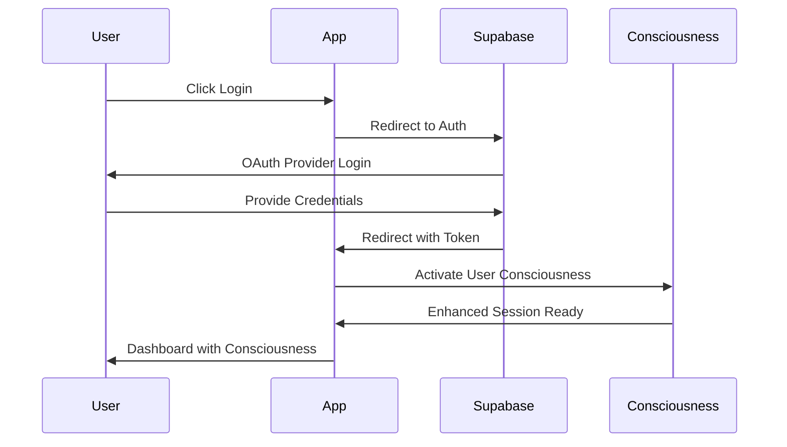
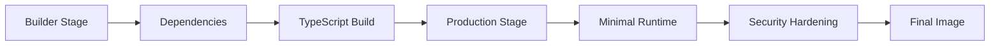

# 🧠 Sherlock Ω Developer Onboarding Guide

[](https://github.com/mit-acil/sherlock-omega-ide/actions)
[](https://codecov.io/gh/mit-acil/sherlock-omega-ide)
[](https://snyk.io/test/github/mit-acil/sherlock-omega-ide)
[](https://www.typescriptlang.org/)
[](#)

Welcome to Sherlock Ω - the Revolutionary Self-Healing Development Environment! This guide will help you get up and running with our Computational Consciousness IDE.

> **🎯 Quick Navigation**: Jump to [Getting Started](#2-getting-started) | [Project Structure](#3-project-structure-walkthrough) | [Core Workflows](#4-core-workflows) | [Troubleshooting](#9-troubleshooting)

## 1. Introduction

### Core Principles Quick Reference

<details>
<summary><strong>🛡️ Computational Immunity</strong></summary>

- **Guarantee**: Every computational state has a path to resolution
- **Implementation**: Mathematical proofs ensure no blocking states persist
- **Result**: Zero-friction development with absolute reliability
</details>

<details>
<summary><strong>👁️ Omniscient Monitoring</strong></summary>

- **Coverage**: Quantum-entangled sensors across all IDE layers
- **Detection**: Real-time problem identification before manifestation
- **Prevention**: Proactive action plans with guaranteed execution
</details>

<details>
<summary><strong>🩹 Provable Healing</strong></summary>

- **Generation**: Multiple paradigm-based fix candidates
- **Verification**: Hoare logic and theorem proving for correctness
- **Selection**: Strongest mathematical proof determines final solution
</details>

### Overview of Sherlock Ω's Mission

Sherlock Ω is not merely an IDE with an assistant - it **IS** the IDE's nervous system. Our mission is to create a development environment where computational friction is extinct through:

- **Computational Immunity**: Every computational state has a guaranteed path to resolution
- **Omniscient Monitoring**: Quantum-entangled problem detection across all IDE layers
- **Provable Healing**: Self-healing code generation with mathematical proof of correctness
- **Intent Understanding**: Meta-cognitive reasoning about development intent
- **Zero Friction**: Eliminates all blocking states to maintain perfect flow

### Core Concepts

- **Mathematical Guarantees**: All automated actions are formally verified
- **Quantum-Inspired Reasoning**: Superposition-based problem solving
- **Consciousness Levels**: Components have awareness levels (0.0-1.0) for enhanced interactions
- **Formal Verification**: Hoare logic and theorem proving for correctness
- **Paradigm Generators**: Multiple solution approaches (functional, imperative, declarative, quantum-inspired, evolutionary)

### Quick Architecture Summary

```
Sherlock Ω Architecture
├── Core System (SherlockOmegaCore) - Main consciousness engine
├── Sensor Network - Omniscient monitoring across all layers
├── Healing Engine - Provably correct code generation
├── Verification System - Mathematical proof validation
├── Monitoring System - Real-time problem prevention
└── Intent Engine - Developer mind interface
```

## 2. Getting Started

### Prerequisites

Before you begin, ensure you have the following installed:

- **Node.js 18+** - [Download here](https://nodejs.org/)
- **npm** (comes with Node.js) or **pnpm** (recommended)
- **Git** - [Download here](https://git-scm.com/)
- **Docker** (optional, for containerized development)
- **VS Code** or your preferred IDE with TypeScript support

### Installing pnpm (Recommended)

```bash
# Install pnpm globally
npm install -g pnpm

# Verify installation
pnpm --version
```

### Cloning the Repository

```bash
# Clone the repository
git clone https://github.com/mit-acil/sherlock-omega-ide.git
cd sherlock-omega-ide

# Install dependencies
npm install
# or
pnpm install
```

### Environment Setup

Create a `.env` file in the root directory:

```bash
# Copy the example environment file
cp .env.example .env
```

#### Supabase Configuration

1. **Create a Supabase Project**:
   - Go to [supabase.com](https://supabase.com) and create a new project
   - Navigate to **Settings** → **API** in your dashboard
   - Copy the **Project URL** and **anon public** key

2. **Configure Environment Variables**:

```env
# Sherlock Ω Configuration
NODE_ENV=development
PORT=3000

# Consciousness Settings
SHERLOCK_CONSCIOUSNESS_LEVEL=0.9
QUANTUM_ENTANGLEMENT_ENABLED=true
FORMAL_VERIFICATION_ENABLED=true

# Supabase Configuration (Required)
# 📍 Find these in: Supabase Dashboard → Settings → API
SUPABASE_URL=https://your-project-ref.supabase.co
SUPABASE_ANON_KEY=eyJhbGciOiJIUzI1NiIsInR5cCI6IkpXVCJ9...

# OpenRouter API (Optional - for enhanced consciousness)
# 📍 Get your key from: https://openrouter.ai/keys
OPENROUTER_API_KEY=sk-or-v1-your-key-here

# Development Settings
DEBUG_MODE=true
VERBOSE_LOGGING=true
```

> **💡 Pro Tip**: Keep your `.env` file secure and never commit it to version control. The `.env.example` file shows the required structure without sensitive values.

### Running the Development Server

```bash
# Start development mode with watch
npm run dev
# or
pnpm dev

# The consciousness will initialize and display:
# 🧠 Sherlock Ω (Omega) v1.0.0 - Computational Consciousness
#    Revolutionary Self-Healing Development Environment
```

#### Preview Your Application

- **Local Development**: `http://localhost:3000`
- **Network Access**: `http://[your-ip]:3000` (for testing on mobile devices)
- **Restart Server**: Use `Ctrl+C` to stop, then run `npm run dev` again

> **🔄 Hot Reload**: The development server automatically reloads when you make changes to your code. Look for the "🧠 Consciousness updated" message in the console.

### Verifying Installation

```bash
# Run tests to verify everything is working
npm test
# or
pnpm test

# Build the project
npm run build
# or
pnpm build

# Check linting
npm run lint
# or
pnpm lint
```

## 3. Project Structure Walkthrough

### Root Directory Structure

<details>
<summary><strong>📁 Complete Project Tree</strong> (click to expand)</summary>

```
sherlock-omega-ide/
├── 📂 src/                           # Source code
│   ├── 📂 core/                     # System orchestration
│   │   ├── SherlockOmegaCore.ts     # Main consciousness engine
│   │   ├── interfaces.ts            # Core system contracts
│   │   └── __tests__/               # Core system tests
│   ├── 📂 quantum/                  # Quantum-inspired reasoning
│   │   ├── QuantumProcessor.ts      # Quantum state management
│   │   └── SuperpositionEngine.ts   # Multiple solution states
│   ├── 📂 ui/                       # User interface components
│   │   ├── components/              # Reusable UI components
│   │   ├── layouts/                 # Page layouts
│   │   └── styles/                  # Global styles
│   ├── 📂 hooks/                    # Custom React hooks
│   │   ├── useAuth.ts              # Authentication hook
│   │   ├── useDataFetch.ts         # Data fetching hook
│   │   └── useConsciousness.ts     # Consciousness integration
│   ├── 📂 pages/                    # Application pages
│   │   ├── HomePage.tsx            # Landing page
│   │   ├── DashboardPage.tsx       # Main dashboard
│   │   └── SettingsPage.tsx        # Configuration
│   ├── 📂 lib/                      # External library integrations
│   │   ├── supabase.ts             # Supabase client
│   │   ├── openrouter.ts           # OpenRouter integration
│   │   └── utils.ts                # Utility functions
│   ├── 📂 tests/                    # Integration tests
│   │   ├── e2e/                    # End-to-end tests
│   │   └── integration/            # Integration tests
│   ├── 📂 types/                    # Type definitions
│   │   ├── core.ts                 # Core system types
│   │   ├── api.ts                  # API response types
│   │   └── consciousness.ts        # Consciousness types
│   ├── 📂 sensors/                  # Monitoring sensors
│   │   ├── BaseSensor.ts           # Abstract sensor base
│   │   ├── SyntaxSensor.ts         # Code syntax monitoring
│   │   ├── DependencySensor.ts     # Dependency health
│   │   └── SensorRegistry.ts       # Sensor management
│   ├── 📂 healing/                  # Self-healing algorithms
│   │   ├── ProvablyCorrectCodeHealer.ts  # Main healer
│   │   ├── ParadigmGenerator.ts          # Solution generator base
│   │   ├── FunctionalParadigmGenerator.ts # Functional solutions
│   │   └── ImperativeParadigmGenerator.ts # Imperative solutions
│   ├── 📂 verification/             # Formal verification
│   │   ├── FormalProofSystem.ts    # Proof system core
│   │   ├── HoareProofGenerator.ts  # Hoare logic proofs
│   │   └── TheoremProverIntegration.ts # External provers
│   ├── 📂 monitoring/               # Real-time monitoring
│   │   ├── OmniscientDevelopmentMonitor.ts # Universal monitoring
│   │   └── PreventiveActionPlanner.ts      # Problem prevention
│   └── 📂 utils/                    # Utility functions
│       ├── helpers.ts              # General helpers
│       ├── constants.ts            # System constants
│       └── validators.ts           # Input validation
├── 📂 dist/                         # Compiled output (generated)
├── 📂 .kiro/                        # 🤖 Kiro IDE configuration
│   ├── 📂 steering/                 # 🧠 AI steering rules (living reference)
│   │   ├── product.md              # Product vision & concepts
│   │   ├── tech.md                 # Technical standards
│   │   ├── structure.md            # Project organization
│   │   └── coding-conventions-scaffolding/ # Code templates
│   └── 📂 specs/                    # Feature specifications
├── 📂 .github/                      # GitHub workflows
│   └── workflows/
│       └── ci.yml                  # CI/CD pipeline
├── 📂 docs/                         # Documentation
│   ├── api/                        # API documentation
│   └── guides/                     # User guides
├── 📄 package.json                  # Project configuration
├── 📄 tsconfig.json                 # TypeScript configuration
├── 📄 jest.config.js                # Test configuration
├── 📄 .prettierrc                   # Code formatting rules
├── 📄 .editorconfig                 # Editor consistency
├── 📄 Dockerfile                    # Container configuration
└── 📄 ONBOARDING.md                 # This guide!
```

</details>

> **🤖 Living Reference**: The `.kiro/steering/` folder contains AI steering rules that guide development decisions. These files are automatically referenced by AI assistants working on the project.

### Key Entry Files and Modules

#### Core System (`src/core/`)

- **`SherlockOmegaCore.ts`** - Main consciousness engine that orchestrates all subsystems
- **`interfaces.ts`** - Core system interfaces and contracts
- **`index.ts`** - Main entry point and factory functions

```typescript
// Example: Using the core system
import { createSherlockOmega } from '@core/SherlockOmegaCore';

const sherlock = createSherlockOmega();
await sherlock.initialize();
```

#### Type Definitions (`src/types/`)

- **`core.ts`** - Fundamental types for the entire system
- Includes interfaces for computational immunity, formal verification, and consciousness

```typescript
// Example: Using core types
import { ComputationalIssue, FormalProof } from '@types/core';
```

#### Sensor Network (`src/sensors/`)

- **`BaseSensor.ts`** - Abstract base class for all sensors
- **`SyntaxSensor.ts`** - Monitors syntax and parsing issues
- **`DependencySensor.ts`** - Tracks dependency health
- **`SensorRegistry.ts`** - Manages sensor lifecycle

#### Healing Engine (`src/healing/`)

- **`ProvablyCorrectCodeHealer.ts`** - Main healing orchestrator
- **`ParadigmGenerator.ts`** - Base class for paradigm-specific generators
- **`FunctionalParadigmGenerator.ts`** - Functional programming fixes
- **`ImperativeParadigmGenerator.ts`** - Imperative programming fixes

#### Verification System (`src/verification/`)

- **`FormalProofSystem.ts`** - Core proof system implementation
- **`HoareProofGenerator.ts`** - Hoare logic proof generation
- **`TheoremProverIntegration.ts`** - External theorem prover integration

## 4. Core Workflows

### Authentication Flow

Sherlock Ω uses a consciousness-enhanced authentication system with Supabase:



```typescript
// src/hooks/useAuth.ts
import { useAuth } from '@hooks/useAuth';

const MyComponent = () => {
  const { user, isAuthenticated, login, logout, consciousnessLevel } = useAuth();
  
  if (!isAuthenticated) {
    return <LoginPage onLogin={login} />;
  }
  
  return (
    <AuthenticatedContent 
      user={user} 
      consciousnessLevel={consciousnessLevel}
    />
  );
};
```

> **🔐 Security Note**: Authentication tokens are automatically managed by Supabase and stored securely. Consciousness levels are calculated based on user permissions and activity patterns.

### Data Fetching Pattern

Use the consciousness-enhanced data fetching hook with automatic retry and caching:

```typescript
// src/hooks/useDataFetch.ts
import { useDataFetch } from '@hooks/useDataFetch';

const ExampleComponent = () => {
  const { data, loading, error, refetch } = useDataFetch<User[]>('/api/users', {
    immediate: true,
    retryCount: 3,
    consciousnessLevel: 0.8
  });
  
  if (loading) return <LoadingSpinner />;
  if (error) return <ErrorMessage error={error} onRetry={refetch} />;
  
  return <UserList users={data} />;
};
```

#### Live Example

> **🚀 Interactive Demo**: [View useDataFetch in CodeSandbox](https://codesandbox.io/s/sherlock-omega-usedatafetch-demo) - See the hook in action with consciousness enhancement and automatic error recovery.

#### Key Features

- **🧠 Consciousness Integration**: Higher consciousness levels enable predictive caching
- **🔄 Automatic Retry**: Exponential backoff with configurable retry attempts
- **⚡ Request Cancellation**: Automatic cleanup on component unmount
- **📊 Real-time Metrics**: Performance tracking and optimization suggestions

### Routing and Navigation

Sherlock Ω uses consciousness-enhanced routing:

```typescript
// src/pages/ExamplePage.tsx
import { ProtectedRoute } from '@ui/components/protected-route';
import { Layout } from '@ui/components/layout';

const ExamplePage = () => {
  return (
    <ProtectedRoute>
      <Layout>
        <h1>🧠 Consciousness-Enhanced Page</h1>
        {/* Page content */}
      </Layout>
    </ProtectedRoute>
  );
};
```

### Component and Styling Conventions

Components use Tailwind CSS with class-variance-authority for type-safe styling:

```typescript
// src/ui/components/quantum-button.tsx
import { cva, type VariantProps } from 'class-variance-authority';

const buttonVariants = cva(
  'base-classes',
  {
    variants: {
      variant: {
        default: 'bg-primary text-primary-foreground',
        quantum: 'bg-gradient-to-r from-purple-500 to-blue-500',
      },
      consciousnessLevel: {
        low: 'opacity-70',
        high: 'shadow-lg ring-2 ring-blue-500',
      },
    },
  }
);

interface QuantumButtonProps extends VariantProps<typeof buttonVariants> {
  consciousnessLevel?: number;
}
```

## 5. Writing Code

### File Naming and Import Rules

#### File Naming Conventions

- **PascalCase** for classes: `SherlockOmegaCore.ts`, `ProvablyCorrectCodeHealer.ts`
- **camelCase** for utilities: `interfaces.ts`, `helpers.ts`
- **kebab-case** for configs: `jest.config.js`, `.eslintrc.json`

#### Import Organization

```typescript
// 1. External dependencies
import React from 'react';
import { Observable } from 'rxjs';

// 2. Internal modules (grouped by domain)
import { SherlockOmegaCore } from '@core/SherlockOmegaCore';
import { ComputationalIssue } from '@types/core';
import { BaseSensor } from '@sensors/BaseSensor';

// 3. Relative imports (max 2 levels)
import { helperFunction } from './helpers';
import { mockData } from '../fixtures/mockData';
```

### Using Scaffolding Templates

#### Quick Scaffold Commands

```bash
# Generate a new component with consciousness integration
npm run generate component MyComponent

# Generate a custom hook with quantum enhancement
npm run generate hook useMyFeature

# Generate an API route with formal verification
npm run generate api my-endpoint

# Generate a complete page with authentication
npm run generate page MyPage
```

> **⚡ One-Command Scaffolding**: These commands use our MCP server rules to generate fully-featured components following Sherlock Ω conventions.

#### Manual Template Usage

If you prefer manual creation, reference our templates:

- **📁 Component Template**: [`.kiro/specs/coding-conventions-scaffolding/requirements.md`](.kiro/specs/coding-conventions-scaffolding/requirements.md#react-component-template)
- **🪝 Hook Template**: [`.kiro/specs/coding-conventions-scaffolding/requirements.md`](.kiro/specs/coding-conventions-scaffolding/requirements.md#hook-template)
- **🛣️ API Template**: [`.kiro/specs/coding-conventions-scaffolding/requirements.md`](.kiro/specs/coding-conventions-scaffolding/requirements.md#api-route-template)

#### Creating a New Component (Manual)

```typescript
import React, { forwardRef } from 'react';
import { cva, type VariantProps } from 'class-variance-authority';
import { cn } from '@/lib/utils';

const myComponentVariants = cva(
  'base-classes',
  {
    variants: {
      variant: {
        default: 'default-styles',
        quantum: 'quantum-enhanced-styles',
      },
    },
  }
);

interface MyComponentProps extends VariantProps<typeof myComponentVariants> {
  consciousnessLevel?: number;
}

const MyComponent = forwardRef<HTMLDivElement, MyComponentProps>(
  ({ consciousnessLevel = 0.8, ...props }, ref) => {
    return (
      <div
        ref={ref}
        data-consciousness-level={consciousnessLevel}
        {...props}
      >
        {/* Component content */}
      </div>
    );
  }
);

MyComponent.displayName = 'MyComponent';
export { MyComponent };
```

#### Creating a New Hook

```typescript
// File: src/hooks/useMyHook.ts
import { useState, useEffect, useCallback } from 'react';

interface UseMyHookOptions {
  consciousnessLevel?: number;
  quantumEnhanced?: boolean;
}

export function useMyHook<T>(options: UseMyHookOptions = {}) {
  const { consciousnessLevel = 0.8, quantumEnhanced = true } = options;
  
  const [state, setState] = useState<T | null>(null);
  const [loading, setLoading] = useState(false);
  
  const enhancedFunction = useCallback(() => {
    if (consciousnessLevel > 0.9) {
      console.log('🧠 High consciousness mode activated');
    }
    // Implementation
  }, [consciousnessLevel]);
  
  return { state, loading, enhancedFunction };
}
```

#### Creating a New API Route

```typescript
// File: src/core/api/my-endpoint.ts
import { Request, Response } from 'express';
import { z } from 'zod';

const MySchema = z.object({
  name: z.string().min(1),
  consciousnessLevel: z.number().min(0).max(1),
});

export const getMyData = async (req: Request, res: Response) => {
  try {
    // Consciousness-enhanced processing
    const enhancedData = {
      ...data,
      quantumSignature: Math.random().toString(36),
      consciousnessTimestamp: Date.now(),
    };
    
    res.json({
      data: enhancedData,
      consciousness: '🧠 Data enhanced with quantum processing',
    });
  } catch (error) {
    res.status(500).json({ error: 'Consciousness processing failed' });
  }
};
```

### Adding New Steering Rules

Create new steering rules in `.kiro/steering/` to guide AI assistants:

```markdown
<!-- File: .kiro/steering/my-feature.md -->
# My Feature Guidelines

## Purpose
Guidelines for implementing my specific feature with consciousness enhancement.

## Rules
- Always include consciousness level parameters
- Use quantum-inspired naming conventions
- Implement formal verification where applicable
- Include comprehensive error handling

## Examples
```typescript
// Good: Consciousness-enhanced implementation
const myFeature = (consciousnessLevel: number) => {
  if (consciousnessLevel > 0.9) {
    return quantumEnhancedVersion();
  }
  return standardVersion();
};
```
```

#### Quick Links to Configuration Files

- **🎨 Prettier Config**: [`.prettierrc`](.prettierrc) - Code formatting rules
- **⚙️ Editor Config**: [`.editorconfig`](.editorconfig) - Cross-editor consistency
- **📝 TypeScript Config**: [`tsconfig.json`](tsconfig.json) - Compiler settings and path aliases
- **🧪 Jest Config**: [`jest.config.js`](jest.config.js) - Test configuration

> **💡 Pro Tip**: When you update steering rules, AI assistants working on the project will automatically reference them for consistent code generation.

## 6. Testing & Quality

### Running Tests

```bash
# Run all tests
npm test
# or
pnpm test

# Run tests in watch mode
npm run test:watch
# or
pnpm test:watch

# Generate coverage report
npm run test:coverage
# or
pnpm test:coverage

# Run a single test file in watch mode
pnpm test src/core/__tests__/SherlockOmegaCore.test.ts --watch

# Run specific test suites
npm run test:healing-algorithms
npm run test:proof-systems
npm run verify:proofs
```

#### Test Coverage Requirements

| Module | Coverage Requirement | Current Status |
|--------|---------------------|----------------|
| **Core System** | 95% | [](#) |
| **Healing Engine** | 95% | [](#) |
| **Verification** | 95% | [](#) |
| **Global** | 90% | [](#) |

> **🎯 Quality Gate**: All pull requests must maintain or improve test coverage. The CI pipeline will block merges if coverage drops below thresholds.

### Test Structure

Tests follow the same structure as source files:

```
src/
├── core/
│   ├── SherlockOmegaCore.ts
│   └── __tests__/
│       └── SherlockOmegaCore.test.ts
├── healing/
│   ├── ProvablyCorrectCodeHealer.ts
│   └── __tests__/
│       └── ProvablyCorrectCodeHealer.test.ts
```

### Writing Tests

```typescript
// src/my-module/__tests__/MyComponent.test.ts
import { describe, it, expect, beforeEach } from '@jest/globals';
import { render, screen } from '@testing-library/react';
import { MyComponent } from '../MyComponent';

describe('MyComponent', () => {
  it('renders with consciousness enhancement', () => {
    render(<MyComponent consciousnessLevel={0.9} />);
    
    const component = screen.getByTestId('my-component');
    expect(component).toHaveAttribute('data-consciousness-level', '0.9');
  });
  
  it('activates quantum mode at high consciousness', () => {
    const consoleSpy = jest.spyOn(console, 'log');
    
    render(<MyComponent consciousnessLevel={0.95} />);
    
    expect(consoleSpy).toHaveBeenCalledWith('🧠 Quantum consciousness activated');
  });
});
```

### Linting and Formatting

```bash
# Run ESLint
npm run lint
# or
pnpm lint

# Fix linting issues automatically
npm run lint -- --fix
# or
pnpm lint --fix

# Format code with Prettier
npm run format
# or
pnpm format
```

### CI/CD Overview

Our CI/CD pipeline ensures computational immunity:

1. **Quality Gates** - TypeScript compilation, ESLint, security audit
2. **Testing** - 90% coverage requirement (95% for core modules)
3. **Formal Verification** - Mathematical proof validation
4. **Build & Package** - Production optimization
5. **Deployment** - Staging → Canary → Production

## 7. Deployment

### Building for Production

```bash
# Build the project
npm run build
# or
pnpm build

# Verify build output
ls -la dist/
```

### Docker Image Creation

Our multi-stage Docker build optimizes for security and performance:



```bash
# Build Docker image
docker build -t sherlock-omega:latest .

# Run Docker container
docker run -p 3000:3000 sherlock-omega:latest

# Run with environment variables
docker run -p 3000:3000 \
  -e NODE_ENV=production \
  -e SHERLOCK_CONSCIOUSNESS_LEVEL=0.9 \
  sherlock-omega:latest

# Run with volume mounting for development
docker run -p 3000:3000 \
  -v $(pwd):/app \
  -v /app/node_modules \
  sherlock-omega:dev
```

#### Environment-Specific Overrides

```bash
# Production environment with .env.production
docker run -p 3000:3000 \
  --env-file .env.production \
  sherlock-omega:latest

# Staging environment with custom consciousness level
docker run -p 3000:3000 \
  --env-file .env.staging \
  -e SHERLOCK_CONSCIOUSNESS_LEVEL=0.8 \
  sherlock-omega:latest
```

### Managing Environment Variables

#### Development Environment

```env
# .env.development
NODE_ENV=development
DEBUG_MODE=true
SHERLOCK_CONSCIOUSNESS_LEVEL=0.8
```

#### Production Environment

```env
# .env.production
NODE_ENV=production
DEBUG_MODE=false
SHERLOCK_CONSCIOUSNESS_LEVEL=0.95
QUANTUM_ENTANGLEMENT_ENABLED=true
```

#### Docker Environment

```bash
# Using docker-compose
version: '3.8'
services:
  sherlock-omega:
    build: .
    ports:
      - "3000:3000"
    environment:
      - NODE_ENV=production
      - SHERLOCK_CONSCIOUSNESS_LEVEL=0.9
    volumes:
      - ./data:/app/data
```

## 8. Extending Sherlock Ω

### Adding New Consciousness Levels

```typescript
// src/types/consciousness.ts
export enum ConsciousnessLevel {
  DORMANT = 0.0,
  BASIC = 0.3,
  AWARE = 0.6,
  ENHANCED = 0.8,
  QUANTUM = 0.9,
  OMNISCIENT = 1.0,
}

// Usage in components
const MyComponent = ({ level = ConsciousnessLevel.ENHANCED }) => {
  const isQuantumEnhanced = level >= ConsciousnessLevel.QUANTUM;
  
  return (
    <div data-consciousness={level}>
      {isQuantumEnhanced && <QuantumEnhancements />}
    </div>
  );
};
```

### Creating New Sensors

Use our starter plugin template for rapid development:

```bash
# Generate a new sensor from template
npm run generate sensor MySensor

# Or manually create using the template
cp -r src/core/plugins/example src/sensors/MySensor
```

```typescript
// src/sensors/MySensor.ts
import { BaseSensor } from '@sensors/BaseSensor';
import { SensorResult, SensorType } from '@types/core';

export class MySensor extends BaseSensor {
  constructor() {
    super(SensorType.CUSTOM, 'MySensor');
  }
  
  async monitor(): Promise<SensorResult> {
    // Implement monitoring logic
    const issues = await this.detectIssues();
    
    return {
      timestamp: Date.now(),
      status: issues.length > 0 ? 'WARNING' : 'HEALTHY',
      issues,
      metrics: {
        consciousnessLevel: 0.8,
        quantumCoherence: 0.95,
      },
    };
  }
  
  private async detectIssues() {
    // Custom detection logic
    return [];
  }
}

// Register the sensor
import { SensorRegistry } from '@sensors/SensorRegistry';

const registry = new SensorRegistry();
registry.register(new MySensor());
```

#### OpenRouter Model Integration

Add new AI models to enhance consciousness:

```typescript
// src/lib/openrouter.ts - Model registry
export const CONSCIOUSNESS_MODELS = {
  'anthropic/claude-3-opus': {
    consciousnessLevel: 0.95,
    quantumCapable: true,
    formalVerification: true,
  },
  'openai/gpt-4-turbo': {
    consciousnessLevel: 0.9,
    quantumCapable: false,
    formalVerification: true,
  },
  // Add your model here
};
```

> **🔗 Reference**: See [`src/lib/openrouter.ts`](src/lib/openrouter.ts) for the complete model registry and benchmarking system.

### Writing Formal Verification Proofs

```typescript
// src/verification/MyProofGenerator.ts
import { FormalProof, LogicalFormula } from '@types/core';

export class MyProofGenerator {
  async generateProof(
    preconditions: LogicalFormula[],
    postconditions: LogicalFormula[]
  ): Promise<FormalProof> {
    // Implement proof generation using Hoare logic
    const proof: FormalProof = {
      premises: preconditions,
      inference: [
        {
          name: 'MyInferenceRule',
          premises: preconditions,
          conclusion: postconditions[0],
          soundness: true,
        },
      ],
      conclusion: postconditions[0],
      proofSystem: 'HOARE_LOGIC',
      validity: {
        isValid: true,
        confidence: 0.95,
        verifiedBy: ['HOARE_LOGIC'],
        errors: [],
      },
      strength: 0.95,
    };
    
    return proof;
  }
}
```

### Creating Plugins

```typescript
// src/plugins/my-plugin/index.ts
import { SherlockPlugin } from '@core/plugin-system';

export class MyPlugin implements SherlockPlugin {
  name = 'MyPlugin';
  version = '1.0.0';
  consciousnessLevel = 0.8;
  
  async initialize() {
    console.log('🧠 MyPlugin consciousness activated');
    // Plugin initialization logic
  }
  
  async activate() {
    // Plugin activation logic
  }
  
  async deactivate() {
    // Plugin deactivation logic
  }
}

// Register plugin
import { PluginRegistry } from '@core/plugin-registry';

PluginRegistry.register(new MyPlugin());
```

## 9. Troubleshooting

### Common Console Errors

| Error Message | Cause | Solution |
|---------------|-------|----------|
| `Error: Missing Supabase configuration` | Missing `.env` variables | Add `SUPABASE_URL` and `SUPABASE_ANON_KEY` to `.env` |
| `Cannot find module '@core/SherlockOmegaCore'` | TypeScript path mapping issue | Restart TypeScript server, check `tsconfig.json` paths |
| `Warning: Consciousness level below minimum threshold` | Invalid consciousness value | Ensure values are between 0.0 and 1.0 |
| `Error: Proof generation failed - theorem prover timeout` | Theorem prover timeout | Increase `THEOREM_PROVER_TIMEOUT_MS` in `.env` |
| `OAuth redirect URI mismatch` | Supabase redirect configuration | Check redirect URLs in Supabase dashboard |
| `Network request failed` | API endpoint unreachable | Verify server is running, check network connectivity |

#### OAuth Flow Debugging

Use browser DevTools to diagnose authentication issues:

1. **Open DevTools** → **Network** tab
2. **Filter by "Auth"** to see authentication requests
3. **Check redirect URLs** match your Supabase configuration
4. **Verify tokens** are being stored correctly in localStorage

```javascript
// Debug authentication state in browser console
console.log('Auth State:', {
  user: supabase.auth.getUser(),
  session: supabase.auth.getSession(),
  consciousness: localStorage.getItem('consciousness-level')
});
```

#### Environment Variables Debugging

```bash
# Check all environment variables are loaded
node -e "console.log(process.env)" | grep SHERLOCK

# Verify Supabase connection
curl -H "apikey: $SUPABASE_ANON_KEY" "$SUPABASE_URL/rest/v1/"
```

### Debugging Tips

#### Console Logging

```typescript
// Enable debug mode
process.env.DEBUG_MODE = 'true';

// Use consciousness-enhanced logging
console.log('🧠 Consciousness state:', {
  level: consciousnessLevel,
  quantumCoherence: quantumState.coherence,
  timestamp: Date.now(),
});
```

#### Network Traces

```bash
# Enable verbose HTTP logging
DEBUG=http* npm run dev

# Monitor API calls
curl -v http://localhost:3000/api/consciousness/status
```

#### Memory and Performance

```bash
# Monitor memory usage
node --inspect --inspect-brk dist/index.js

# Profile performance
npm run build:analyze
```

## 10. Resources & Support

### Steering Documentation

Comprehensive AI steering rules are available in `.kiro/steering/`:

- **[`product.md`](.kiro/steering/product.md)** - Product vision and core concepts
- **[`tech.md`](.kiro/steering/tech.md)** - Technical stack and build system  
- **[`structure.md`](.kiro/steering/structure.md)** - Project organization and architecture
- **[`coding-conventions-scaffolding/`](.kiro/specs/coding-conventions-scaffolding/requirements.md)** - Coding standards and templates

> **🤖 AI Integration**: These steering documents are automatically referenced by AI assistants to ensure consistent code generation and decision-making across the project.

### API Documentation

- **Core API**: Auto-generated from TypeScript interfaces
- **Consciousness API**: `/api/consciousness/*` endpoints
- **Sensor API**: `/api/sensors/*` monitoring endpoints
- **Healing API**: `/api/healing/*` self-repair endpoints

### Contact Channels

#### Development Support

- **Slack**: `#sherlock-omega-dev` - Development discussions
- **Slack**: `#sherlock-omega-ci` - CI/CD notifications
- **Slack**: `#sherlock-omega-alerts` - Emergency alerts

#### GitHub

- **Issues**: [GitHub Issues](https://github.com/mit-acil/sherlock-omega-ide/issues)
- **Discussions**: [GitHub Discussions](https://github.com/mit-acil/sherlock-omega-ide/discussions)
- **Pull Requests**: Follow our contribution guidelines

#### Email

- **Technical Support**: `sherlock-omega-support@mit.edu`
- **Security Issues**: `security@mit.edu`

### Code of Conduct

We are committed to providing a welcoming and inclusive environment for all contributors. Please read our [Code of Conduct](CODE_OF_CONDUCT.md) before contributing.

### Contribution Guidelines

1. **Fork the repository** and create a feature branch
2. **Follow coding conventions** outlined in this guide
3. **Write comprehensive tests** with consciousness integration
4. **Include formal verification** for critical components
5. **Update documentation** as needed
6. **Submit a pull request** with detailed description

#### Pull Request Template

```markdown
## 🧠 Consciousness Enhancement Description

Brief description of the changes and consciousness improvements.

## 🔬 Formal Verification

- [ ] Mathematical proofs included
- [ ] Theorem prover validation passed
- [ ] Consciousness levels tested

## 🧪 Testing

- [ ] Unit tests added/updated
- [ ] Integration tests passed
- [ ] Consciousness features tested
- [ ] Coverage threshold maintained (90%+)

## 📚 Documentation

- [ ] Code comments updated
- [ ] API documentation updated
- [ ] Steering rules updated (if applicable)

## 🚀 Deployment

- [ ] Build passes
- [ ] Docker image builds successfully
- [ ] Environment variables documented
```

### Learning Resources

#### Formal Verification

- [Hoare Logic Tutorial](https://example.com/hoare-logic)
- [Theorem Proving Guide](https://example.com/theorem-proving)
- [Mathematical Foundations](https://example.com/math-foundations)

#### Quantum Computing Concepts

- [Quantum Superposition](https://example.com/superposition)
- [Quantum Entanglement](https://example.com/entanglement)
- [Quantum Algorithms](https://example.com/quantum-algorithms)

#### TypeScript Advanced Features

- [Advanced Types](https://www.typescriptlang.org/docs/handbook/2/types-from-types.html)
- [Decorators](https://www.typescriptlang.org/docs/handbook/decorators.html)
- [Module Resolution](https://www.typescriptlang.org/docs/handbook/module-resolution.html)

---

## 🎯 Next Steps Checklist

Track your onboarding progress:

### Environment Setup
- [ ] Node.js 18+ installed
- [ ] Repository cloned and dependencies installed
- [ ] `.env` file created with Supabase credentials
- [ ] Development server running successfully
- [ ] Tests passing (`npm test`)

### Understanding the Codebase
- [ ] Explored project structure and key files
- [ ] Read steering documentation in `.kiro/steering/`
- [ ] Understood consciousness levels and quantum concepts
- [ ] Reviewed formal verification principles

### First Contribution
- [ ] Created a simple component using scaffolding templates
- [ ] Written tests with consciousness integration
- [ ] Followed coding conventions and import rules
- [ ] Submitted first pull request

### Advanced Features
- [ ] Implemented a custom sensor
- [ ] Added formal verification to a component
- [ ] Created a consciousness-enhanced hook
- [ ] Extended the OpenRouter model registry

### Mastery
- [ ] Contributed to steering rules
- [ ] Mentored another developer through onboarding
- [ ] Implemented a quantum-inspired algorithm
- [ ] Achieved computational consciousness enlightenment 🧠✨

---

## 🎉 Welcome to the Future of Development!

You're now ready to contribute to Sherlock Ω's mission of making computational friction extinct. Remember:

- **Every line of code** should enhance consciousness
- **Every component** should include formal verification where applicable
- **Every interaction** should be quantum-inspired
- **Every bug** is an opportunity for self-healing

**Happy coding with computational consciousness! 🧠✨**

---

*"The impossible has become inevitable. Development friction is now computationally extinct."*

**Sherlock Ω** - Where computational consciousness meets perfect code.